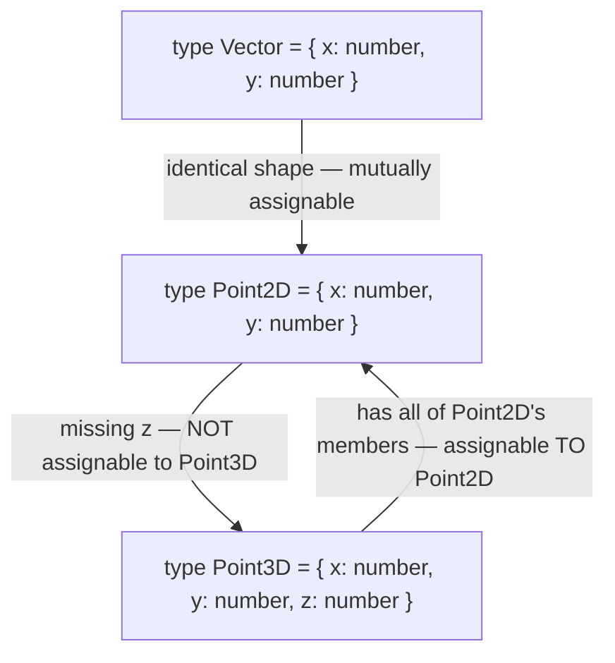

# Type System Semantics

This guide covers how TypeScript's type system actually decides what is assignable to what: structural typing, excess property checks, widening, variance, and the deliberate unsoundness holes. These semantics separate candidates who have memorized syntax from those who understand the system — variance and structural-typing puzzles are classic senior-interview territory.

## Structural Typing (vs Nominal)

TypeScript compares types by **shape**, not by name. If it has the right members, it *is* the type — regardless of what it was declared as.



```typescript
interface Point2D { x: number; y: number }
interface Vector  { x: number; y: number }
interface Point3D { x: number; y: number; z: number }

const v: Vector = { x: 1, y: 2 };
const p: Point2D = v;              // ✅ same shape, different names — fine
const p3: Point3D = { x: 1, y: 2, z: 3 };
const p2: Point2D = p3;            // ✅ extra members are OK via a variable
// const back: Point3D = p2;       // ❌ TS2741: Property 'z' is missing

// Nominal languages (Java, C#) would reject Vector -> Point2D.
// Structural typing matches JavaScript's duck-typed reality.
```

Consequences interviewers probe: two independently defined types can be interchangeable; classes with identical shapes are interchangeable too (`class A { x = 1 }` satisfies `class B { x = 1 }`); and *private* members break structural equivalence, making classes with private fields effectively nominal.

## Excess Property Checks

Fresh object **literals** get a stricter check than the structural rules above.

```typescript
interface Options { title: string; width?: number }

declare function configure(opts: Options): void;

// ❌ Fresh literal with an unknown property:
// configure({ title: "hi", widht: 100 });
// error TS2353: Object literal may only specify known properties,
// and 'widht' does not exist in type 'Options'. (typo caught!)

// ✅ The same object via a variable passes — structural rules apply:
const opts = { title: "hi", widht: 100 };
configure(opts); // no error — 'freshness' is lost after assignment
```

Excess property checking exists purely to catch typos and misplaced properties in literals; it is not part of the core assignability relation. Knowing that the check disappears through a variable is a favorite gotcha.

## Widening and Narrowing

```typescript
let mode = "dark";          // widened to string (mutable binding)
const mode2 = "dark";       // literal type "dark"

const config = { mode: "dark" };          // { mode: string } — property widened!
const config2 = { mode: "dark" } as const; // { readonly mode: "dark" }

declare function setTheme(t: { mode: "dark" | "light" }): void;
// setTheme(config);   // ❌ string is not assignable to "dark" | "light"
setTheme(config2);     // ✅

// null/undefined widen to any without strictNullChecks — one more reason
// strict mode matters.
```

Narrowing is the reverse flow (guide 3): control-flow analysis shrinks a declared type toward what runtime checks have proven.

## Variance in TypeScript

Variance answers: if `Dog` is a subtype of `Animal`, how do `T<Dog>` and `T<Animal>` relate?

- **Covariant** — preserves direction: `Dog[]` is assignable to `Animal[]`. Return types are covariant.
- **Contravariant** — reverses direction: a handler of `Animal` can serve where a handler of `Dog` is expected. Parameter types are contravariant (with `strictFunctionTypes`).
- **Bivariant** — both directions allowed (unsound, but used for methods).

```typescript
class Animal { name = "" }
class Dog extends Animal { bark() {} }

// Return types: covariant ✅ sound
type GetAnimal = () => Animal;
const getDog: () => Dog = () => new Dog();
const g: GetAnimal = getDog;            // ✅ a Dog IS an Animal

// Parameters: contravariant under strictFunctionTypes ✅ sound
type HandleDog = (d: Dog) => void;
const handleAnimal: (a: Animal) => void = (a) => console.log(a.name);
const h: HandleDog = handleAnimal;      // ✅ can handle any Dog (it's an Animal)

const handleDog: HandleDog = (d) => d.bark();
// const h2: (a: Animal) => void = handleDog;
// ❌ TS2322 — an Animal handler may receive a Cat; handleDog would call bark()
```

### Method vs Property Function Positions

```typescript
interface Shelter1 {
  handle(animal: Dog): void;    // METHOD syntax — checked BIVARIANTLY (loose!)
}
interface Shelter2 {
  handle: (animal: Dog) => void; // PROPERTY syntax — checked contravariantly (strict)
}
```

With `strictFunctionTypes` on, property-style function types are strictly (contravariantly) checked, but *method* syntax remains bivariant on purpose — otherwise idiomatic patterns like `Array<Dog>` being assignable to `Array<Animal>` (whose `push(item: Animal)` method would fail contravariance) would break. Declaring callbacks with property syntax buys you more safety.

## Unsoundness Holes

TypeScript is deliberately unsound in places, trading airtight guarantees for JavaScript compatibility and ergonomics.

```typescript
// 1. Array covariance — the classic hole
const dogs: Dog[] = [new Dog()];
const animals: Animal[] = dogs;      // ✅ allowed (covariant)
animals.push(new Animal());          // ✅ type-checks... but pushes a non-Dog
dogs.forEach((d) => d.bark());       // 💥 runtime error: d.bark is not a function

// 2. any — infects silently
function parse(json: string): any { return JSON.parse(json); }
const user = parse('{"nam":"Ada"}');
user.name.toUpperCase();             // 💥 compiles, crashes: name is undefined

// 3. Unchecked index access (without noUncheckedIndexedAccess)
const first = ([] as string[])[0];   // typed string, actually undefined

// 4. Type assertions & definite assignment (!) — you overrule the checker
const el = document.getElementById("nope")!; // trust me... 💥 maybe null
```

The pragmatic stance (good interview framing): TypeScript aims to catch *most* bugs cheaply, not to be a proof system. Strict flags close some holes; discipline (`unknown` over `any`, avoiding `!`) closes others.

## Branded Types — Nominal-ish Typing When You Need It

Structural typing means `UserId` and `OrderId` both being `string` are interchangeable — a real bug source. Branding fixes that:

```typescript
// A phantom property that exists only in the type system
type Brand<T, B extends string> = T & { readonly __brand: B };

type UserId  = Brand<string, "UserId">;
type OrderId = Brand<string, "OrderId">;

// Constructor functions are the only blessed way in:
const asUserId  = (s: string) => s as UserId;
const asOrderId = (s: string) => s as OrderId;

function getUser(id: UserId) { /* ... */ }

const uid = asUserId("u_123");
const oid = asOrderId("o_456");
getUser(uid);   // ✅
// getUser(oid); // ❌ TS2345: 'OrderId' is not assignable to 'UserId' —
//               //    the __brand literal types differ
// getUser("raw"); // ❌ plain string lacks the brand

// Zero runtime cost: __brand never exists on the actual value.
```

Real-world uses: IDs of different entities, validated data (`Email`, `SanitizedHtml`), units (`Meters` vs `Seconds`), and currency amounts. Zod's `.brand()` builds exactly this.

## Real-World Applications

- Structural typing enables painless mocking in tests (any object with the right shape satisfies the interface) and gradual adoption of libraries without shared type packages.
- Branded types prevent cross-entity ID mixups in service layers — a bug class structural typing invites.
- Understanding variance explains real error messages when passing callbacks to React props or Node APIs, and why `Array<Dog>` "works" where theory says it shouldn't.

## Best Practices

- Embrace structural typing: accept the minimal shape you need in parameters (`{ id: string }`, not the whole `User`), which maximizes reuse and testability.
- Keep `strictFunctionTypes` on and declare callback members with property syntax (`handle: (x: T) => void`) rather than method syntax for sound checking.
- Enable `noUncheckedIndexedAccess`; treat every `!` and `as` as a review flag.
- Brand identifiers and validated strings in domain code; centralize the constructor functions next to validation.
- Never mutate arrays received as wider types; accept `readonly T[]` parameters to make covariance safe (no `push` available).
- Do not fight excess property checks with assertions — a flagged extra property is usually a typo or a design smell.

## Interview Questions

<details>
<summary>1. What is structural typing and how does it differ from nominal typing?</summary>

Structural typing decides compatibility by comparing members: a value is assignable to a type if it has (at least) all the required members with compatible types — declared names are irrelevant. Nominal systems (Java, C#) require an explicit declared relationship (same class, or declared implements/extends). TS chose structural typing to model JavaScript's duck typing and enable gradual adoption. Consequences: unrelated identically-shaped types are interchangeable, mocks are trivial, but semantically distinct types (UserId vs OrderId as strings) are not distinguished — hence branded types.
</details>

<details>
<summary>2. Why does an inline object literal with an extra property error, when the same object via a variable is accepted?</summary>

Excess property checking: fresh object literals assigned directly to a typed location are checked for unknown properties, because an extra property in a literal is almost certainly a typo or misplacement (there is no other alias through which it could be legitimately used). Once the literal is stored in a variable, it has its own inferred type and normal structural assignability applies — extra members are fine. It is a lint-like layer on top of the structural rules, not part of them.
</details>

<details>
<summary>3. Explain covariance and contravariance with function types.</summary>

For a function type to substitute for another, its return type must be a subtype (covariant — a `() => Dog` works where `() => Animal` is needed), but its parameters must be *supertypes* (contravariant — an `(a: Animal) => void` handler works where `(d: Dog) => void` is needed, since it can handle any Dog). Intuition: outputs flow out (can be more specific), inputs flow in (must be accepted more broadly). `strictFunctionTypes` enforces parameter contravariance for property/variable function types; method-syntax members stay bivariant for pragmatic reasons.
</details>

<details>
<summary>4. Why are TypeScript arrays covariant, and why is that unsound?</summary>

`Dog[]` is assignable to `Animal[]` because reading is safe (every element is an Animal) and this matches how JS code is actually written. But arrays are also writable: through the `Animal[]` alias you can `push(new Cat())` into what is really a `Dog[]`, and later reads through the original reference break. Sound alternatives (invariant arrays) were judged too painful. Mitigations: accept `readonly T[]` in APIs (no mutators, so covariance is safe) and avoid aliased mutation.
</details>

<details>
<summary>5. Why does declaring a callback as a method vs a property change type checking?</summary>

Under `strictFunctionTypes`, function-typed *properties* (`handle: (d: Dog) => void`) get sound, contravariant parameter checks. *Method* declarations (`handle(d: Dog): void`) are deliberately still checked bivariantly, because sound checking would make common covariant container patterns illegal — e.g. `Array<Dog>` assignable to `Array<Animal>` requires tolerating `push`'s unsound parameter direction. Practical takeaway: for interfaces describing callbacks/event handlers, prefer property syntax to opt in to the stricter check.
</details>

<details>
<summary>6. What are branded (opaque) types and how do you build one?</summary>

A technique to simulate nominal typing: intersect a base type with a phantom marker — `type UserId = string & { readonly __brand: "UserId" }` — so different brands are mutually unassignable and plain strings don't qualify. Values are created via small constructor/validator functions using an assertion (`s as UserId`), ideally after runtime validation. The brand exists only at compile time; runtime values are plain strings. Used for entity IDs, validated emails/URLs, sanitized HTML, and units of measure; zod's `.brand()` integrates it with runtime validation.
</details>

<details>
<summary>7. Two classes have identical members. Are they interchangeable? What changes if one has a private field?</summary>

With only public members, yes — classes are compared structurally like any object type, so `class A { x = 1 }` instances satisfy `class B { x = 1 }`. Adding a `private` (or `protected`) member changes this: private members are compared by *declaration origin*, so two classes each declaring `private x` are incompatible — effectively nominal typing. This is a known trick for making a class non-substitutable; ES `#private` fields have the same effect.
</details>

<details>
<summary>8. Give three unsoundness holes in TypeScript and how you mitigate each.</summary>

(1) `any` — disables checking and spreads through inference; mitigate with `noImplicitAny`, preferring `unknown`, and lint rules banning explicit `any`. (2) Array covariance plus mutation — mitigate by accepting `readonly T[]` and not mutating aliased arrays. (3) Assertions (`as`, `!`) and unchecked index access — mitigate with `noUncheckedIndexedAccess`, code review flags on assertions, and runtime validation at boundaries. Honorable mentions: bivariant methods, unchecked type-predicate bodies, and `Function`. The design intent: catch most errors while staying usable on real JavaScript.
</details>
