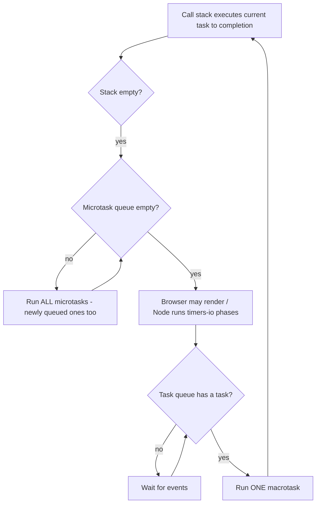

# Async JavaScript and the Event Loop

JavaScript is single-threaded, so all concurrency is built on an event loop that interleaves work — and TypeScript inherits this model wholesale, adding types on top. "What does this code print?" event-loop questions and promise-typing questions are among the most reliably asked interview items for any TypeScript role, frontend or backend.

## The Event Loop: Tasks vs Microtasks

The runtime keeps (at least) two queues. **Macrotasks** (a.k.a. tasks): `setTimeout`, `setInterval`, I/O callbacks, UI events. **Microtasks**: promise reactions (`.then`, `await` continuations), `queueMicrotask`, `MutationObserver`. After every task — and after the initial script — the loop drains the *entire* microtask queue before taking the next task or rendering.



The canonical output-prediction question:

```typescript
console.log("1: script start");

setTimeout(() => console.log("2: timeout"), 0);        // macrotask

Promise.resolve()
  .then(() => console.log("3: promise 1"))              // microtask
  .then(() => console.log("4: promise 2"));             // microtask (queued later)

console.log("5: script end");

// Output: 1, 5, 3, 4, 2
// Sync code first; then ALL microtasks (3 then 4); only then the macrotask (2).
```

And the async/await variant:

```typescript
async function main() {
  console.log("A");
  await null;              // everything after await = a microtask continuation
  console.log("B");
}
main();
console.log("C");
// Output: A, C, B — an async function runs synchronously until the first await.
```

## Callbacks → Promises → async/await

```typescript
// 1. Callback style (Node's original API shape) — "callback hell"
import { readFile } from "node:fs";
readFile("a.txt", "utf8", (err, dataA) => {
  if (err) return console.error(err);
  readFile(dataA.trim(), "utf8", (err2, dataB) => {
    if (err2) return console.error(err2);
    console.log(dataB);
  });
});

// 2. Promises flatten the pyramid and unify error handling
import { readFile as readFileP } from "node:fs/promises";
readFileP("a.txt", "utf8")
  .then((dataA) => readFileP(dataA.trim(), "utf8"))
  .then((dataB) => console.log(dataB))
  .catch((err) => console.error(err)); // one catch for the whole chain

// 3. async/await — synchronous-looking, still non-blocking
async function readChain(): Promise<string> {
  const dataA = await readFileP("a.txt", "utf8");
  return readFileP(dataA.trim(), "utf8");
}
```

A promise is a state machine: `pending` → `fulfilled(value)` or `rejected(reason)`, settling exactly once; extra `resolve`/`reject` calls are ignored. `await` unwraps fulfillment values and rethrows rejections as exceptions.

## Promise Combinators

```typescript
const fast = () => new Promise<string>((res) => setTimeout(() => res("fast"), 10));
const slow = () => new Promise<string>((res) => setTimeout(() => res("slow"), 50));
const bad  = () => Promise.reject(new Error("boom"));

// all: fulfills with a TUPLE of results; rejects on the FIRST rejection (fail-fast)
const [a, b] = await Promise.all([fast(), slow()]); // [string, string]

// allSettled: never rejects; reports every outcome
const settled = await Promise.allSettled([fast(), bad()]);
// Array<{ status: "fulfilled", value: string } | { status: "rejected", reason: any }>
for (const r of settled) {
  if (r.status === "fulfilled") console.log(r.value); // discriminated union!
}

// race: settles like the FIRST promise to settle (fulfill OR reject) — timeouts
const winner = await Promise.race([slow(), fast()]); // "fast"

// any: first FULFILLMENT wins; rejects (AggregateError) only if all reject
const first = await Promise.any([bad(), slow()]);    // "slow"
```

`Promise.all` is variadic-tuple-typed: mixed inputs give a precisely typed tuple (`Promise.all([pNum, pStr])` awaits to `[number, string]`).

## Typing Async Code

```typescript
// An async function ALWAYS returns a Promise — annotate accordingly
async function getUser(id: string): Promise<User> {
  const res = await fetch(`/api/users/${id}`);
  if (!res.ok) throw new Error(`HTTP ${res.status}`);
  return res.json() as Promise<User>; // json() returns Promise<any> — assert or validate
}

// Awaited<T> unwraps promise types (recursively)
type U = Awaited<ReturnType<typeof getUser>>; // User

// Errors in catch are unknown (with useUnknownInCatchVariables, part of strict)
try {
  await getUser("1");
} catch (err) {           // err: unknown — anything can be thrown in JS
  if (err instanceof Error) console.error(err.message);
}
```

## Common Async Pitfalls

```typescript
// ❌ 1. Floating promises — fire-and-forget hides failures
async function save(): Promise<void> { /* ... */ }
function onClick() {
  save(); // rejection becomes an unhandled rejection; ordering is lost
  // eslint(@typescript-eslint/no-floating-promises) flags this — enable it!
}
// ✅ await it, return it, or explicitly void it with a .catch:
// void save().catch(reportError);

// ❌ 2. Sequential awaits for independent work — accidental serialization
const u1 = await getUser("1");   // 100ms
const u2 = await getUser("2");   // +100ms  => 200ms total
// ✅ start both, then await:
const [v1, v2] = await Promise.all([getUser("1"), getUser("2")]); // ~100ms

// ❌ 3. await inside forEach does NOT wait
[1, 2, 3].forEach(async (id) => {
  await save();  // forEach ignores the returned promises entirely
});
console.log("done"); // logs before any save completes!
// ✅ for..of for sequential, Promise.all(map) for parallel:
for (const id of [1, 2, 3]) { await save(); }
await Promise.all([1, 2, 3].map(() => save()));

// ❌ 4. Losing narrowing across await (see guide 3): re-check after resuming.

// ❌ 5. new Promise misuse — wrapping an existing promise (the "explicit
// construction antipattern"):
function getData(): Promise<string> {
  return new Promise((resolve, reject) => {
    readFileP("a.txt", "utf8").then(resolve).catch(reject); // pointless wrapper
  });
}
// ✅ just return readFileP("a.txt", "utf8");
```

## Node.js Notes

Node's loop has phases (timers → pending callbacks → poll → check → close), with microtasks drained between callbacks. Two Node-specific facts worth knowing: `process.nextTick` runs *before* other microtasks (its own queue), and `setImmediate` is a check-phase macrotask that typically runs before `setTimeout(0)` when scheduled from I/O callbacks. Unhandled promise rejections crash modern Node processes by default — one more reason `no-floating-promises` matters on backends.

## Real-World Applications

- **API aggregation**: `Promise.allSettled` for fan-out calls where partial failure is acceptable (dashboards, search federation).
- **Timeout patterns**: `Promise.race([fetchData(), timeout(5000)])` in every production HTTP client.
- **Rate-limited batch jobs**: chunked `Promise.all` or libraries like `p-limit` to bound concurrency.
- **UI responsiveness**: understanding that a long microtask chain blocks rendering explains real jank bugs.

## Best Practices

- Enable `@typescript-eslint/no-floating-promises` and `no-misused-promises`; they catch the two most damaging async bugs mechanically.
- Run independent async operations concurrently (`Promise.all`); reserve sequential `await` for true data dependencies.
- Never pass an `async` callback to `forEach`; use `for...of` or `map` + `Promise.all`.
- Type errors in `catch` as `unknown` and narrow with `instanceof Error`; never assume the shape of a thrown value.
- Use `Promise.allSettled` when partial failure must not abort the batch; `all` when any failure invalidates the whole result.
- Put a timeout (via `race` or `AbortSignal.timeout`) on every external call in production code.

## Interview Questions

<details>
<summary>1. Explain the event loop and the difference between macrotasks and microtasks.</summary>

JS executes one task at a time on a single call stack. When the stack empties, the loop first drains the entire microtask queue (promise reactions, `queueMicrotask`), including microtasks queued by other microtasks, and only then proceeds — render (browser) and pick the next macrotask (`setTimeout` callbacks, I/O, events). So microtasks always run before the next timer/event, and an infinitely self-queueing microtask starves rendering and I/O, while a self-queueing macrotask does not.
</details>

<details>
<summary>2. What does this print: setTimeout(fn, 0) vs Promise.resolve().then(fn) queued together?</summary>

The promise callback runs first. After the synchronous script finishes, the microtask queue (the `.then` callback) is fully drained before the event loop takes the next macrotask (the timeout callback), regardless of the 0ms delay. Standard sequence for the canonical snippet: script logs, then all promise `.then`s in queue order, then timeouts.
</details>

<details>
<summary>3. How much of an async function runs synchronously?</summary>

Everything up to the first `await`. Calling an async function executes its body synchronously until an `await` (or return/throw); at the `await`, the function suspends and returns a pending promise to the caller, and the remainder of the body is scheduled as a microtask continuation when the awaited value settles. Hence `async function f(){ console.log("A"); await x; console.log("B") } ; f(); console.log("C")` prints A, C, B.
</details>

<details>
<summary>4. Compare Promise.all, allSettled, race, and any — and their TypeScript types.</summary>

`all`: waits for all, fulfills with a typed tuple/array of values, rejects on the first rejection (fail-fast). `allSettled`: waits for all, never rejects, fulfills with an array of `PromiseSettledResult` — a discriminated union on `status` you narrow per element. `race`: settles exactly like the first input to settle, fulfillment or rejection — the timeout-pattern primitive. `any`: fulfills with the first fulfillment; rejects with `AggregateError` only if every input rejects. Type-wise, `all` over a tuple of `Promise<A>`/`Promise<B>` produces `Promise<[A, B]>` via variadic tuple types.
</details>

<details>
<summary>5. What is a floating promise and why is it dangerous?</summary>

A promise that is created but neither awaited, returned, nor given a rejection handler — e.g. calling `save()` and ignoring the result. Dangers: rejections become unhandled (crashing modern Node by default, silently vanishing in browsers), completion ordering is unknowable (races with subsequent code), and errors lose their causal stack. Fixes: `await` it, return it to the caller, or explicitly `void promise.catch(handler)` for intentional fire-and-forget. `@typescript-eslint/no-floating-promises` detects them statically.
</details>

<details>
<summary>6. Why doesn't await work inside Array.prototype.forEach?</summary>

Passing an async callback to `forEach` compiles, but `forEach` ignores return values — it neither awaits the returned promises nor sequences them. All iterations start immediately; code after the `forEach` runs before any awaits complete, and rejections float. Use `for...of` with `await` for sequential processing, or `await Promise.all(items.map(async ...))` for concurrent processing (optionally with a concurrency limiter like `p-limit`).
</details>

<details>
<summary>7. Why is the catch-clause variable typed unknown, and how do you handle errors well?</summary>

JavaScript lets you `throw` anything — strings, numbers, plain objects — so no specific type is safe to assume; with `useUnknownInCatchVariables` (part of strict) TS types it `unknown`, forcing narrowing before use. Idiomatic handling: `if (err instanceof Error)` for message/stack access, custom error subclasses with discriminating fields for domain errors, and a small `toError(unknown): Error` normalizer at boundaries. Many teams additionally model expected failures as typed `Result` values instead of throws (guide 11).
</details>

<details>
<summary>8. Two awaits in a row take 200ms for two independent 100ms calls. Fix it and explain.</summary>

`await` suspends the function until that promise settles, so back-to-back awaits serialize the operations even though they don't depend on each other. Start both operations first — calling an async function begins its work immediately — then await together: `const [a, b] = await Promise.all([getA(), getB()])`, restoring ~100ms latency and preserving typed results as a tuple. Fail-fast semantics apply; use `allSettled` if you must observe both outcomes even when one fails.
</details>
