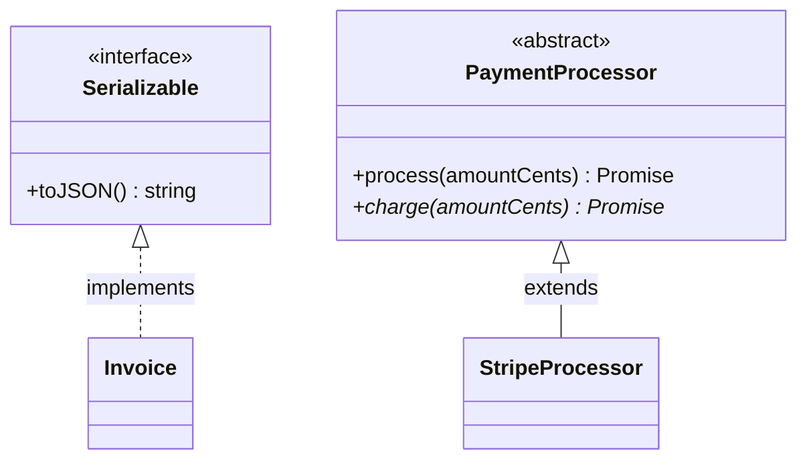

# Classes and Decorators

TypeScript layers access modifiers, abstract members, interface contracts, and parameter properties onto ES classes, and (since TS 5.0) supports the stage-3 ECMAScript decorators that frameworks like NestJS and Angular are built around. Class questions in interviews focus on modifier semantics, `implements` vs `extends`, and how decorators actually work.

## Typed Class Syntax

```typescript
class Account {
  // Field declarations with types; strictPropertyInitialization requires
  // initialization here or in the constructor.
  readonly id: string;
  private balance: number;
  protected owner: string;
  static bankName = "TS Bank";          // shared across all instances

  constructor(id: string, owner: string, openingBalance = 0) {
    this.id = id;
    this.owner = owner;
    this.balance = openingBalance;
  }

  deposit(amount: number): void {
    if (amount <= 0) throw new Error("amount must be positive");
    this.balance += amount;
  }

  get currentBalance(): number {        // typed getter
    return this.balance;
  }
}

const acc = new Account("a1", "Ada", 100);
// acc.balance;      // ❌ TS2341: Property 'balance' is private...
// acc.id = "a2";    // ❌ TS2540: Cannot assign to 'id' — read-only
Account.bankName;    // ✅ statics accessed on the class
```

## Access Modifiers: TS `private` vs ES `#private`

```typescript
class Secret {
  private tsPrivate = 1;   // compile-time only — ERASED at runtime
  #esPrivate = 2;          // real runtime privacy (JS language feature)
}

const s = new Secret();
// s.tsPrivate;            // ❌ compile error...
(s as any).tsPrivate;      // 😬 ...but accessible at runtime — types erase!
// (s as any).#esPrivate;  // ❌ syntax error — truly inaccessible outside
```

| Modifier | Visible in class | Subclasses | Outside | Runtime enforced |
|----------|-----------------|------------|---------|------------------|
| `public` (default) | ✅ | ✅ | ✅ | n/a |
| `protected` | ✅ | ✅ | ❌ | ❌ |
| `private` | ✅ | ❌ | ❌ | ❌ |
| `#field` | ✅ | ❌ | ❌ | ✅ |

Note from guide 6: `private`/`#` members make classes behave nominally — identical shapes stop being interchangeable.

## Parameter Properties

A TypeScript-only shorthand: modifiers on constructor parameters declare and assign fields in one stroke.

```typescript
class UserService {
  constructor(
    private readonly repo: UserRepository,   // declares + assigns this.repo
    private readonly logger: Logger,
  ) {}

  async find(id: string) {
    this.logger.info(`finding ${id}`);
    return this.repo.byId(id);
  }
}
```

This is the idiom underlying constructor-based dependency injection in NestJS and Angular. Caveat: it is non-erasable syntax (generates code), so `erasableSyntaxOnly` environments disallow it.

## Abstract Classes and implements

```typescript
abstract class PaymentProcessor {
  // Abstract members: no body, subclasses MUST implement
  abstract charge(amountCents: number): Promise<string>;

  // Concrete shared logic — the Template Method pattern
  async process(amountCents: number): Promise<string> {
    if (amountCents <= 0) throw new Error("invalid amount");
    return this.charge(amountCents);
  }
}

class StripeProcessor extends PaymentProcessor {
  async charge(amountCents: number): Promise<string> {
    return `stripe_charge_${amountCents}`;
  }
}

// new PaymentProcessor(); // ❌ TS2511: Cannot create an instance of an abstract class.

// implements: pure compile-time contract — NO code inherited
interface Serializable { toJSON(): string }

class Invoice implements Serializable {
  constructor(private total: number) {}
  toJSON(): string { return JSON.stringify({ total: this.total }); }
}
```

`extends` (one base class, inherits implementation, `instanceof` works) vs `implements` (many interfaces, contract only, erased at runtime) is a standard interview contrast. Abstract classes sit in between: contract + shared implementation, but a runtime class exists.



## ES Decorators (Stage 3, TS 5.0+)

A decorator is a function applied to a class or class member at definition time, receiving the target and a context object, and optionally returning a replacement.

```typescript
// Method decorator: wrap the original method
function logged<This, Args extends unknown[], Return>(
  target: (this: This, ...args: Args) => Return,
  context: ClassMethodDecoratorContext<This, (this: This, ...args: Args) => Return>
) {
  const name = String(context.name);
  return function (this: This, ...args: Args): Return {
    console.log(`→ ${name}(${JSON.stringify(args)})`);
    const result = target.call(this, ...args);
    console.log(`← ${name}`);
    return result;
  };
}

class Calculator {
  @logged
  add(a: number, b: number): number {
    return a + b;
  }
}

new Calculator().add(2, 3);
// → add([2,3])
// ← add
```


Decorator kinds: class, method, getter/setter, field (returns an initializer transformer), accessor (`accessor` keyword), and `context.addInitializer` for per-instance setup. Note the older experimental decorators (`experimentalDecorators: true`) have a different signature and support parameter decorators plus `emitDecoratorMetadata` — Angular and NestJS still use that legacy flavor; know which one a codebase targets.

### Framework-Style Use Cases

```typescript
// NestJS-style declarative HTTP routing (conceptually):
@Controller("/users")
class UsersController {
  constructor(private readonly users: UserService) {} // DI via param properties

  @Get("/:id")
  findOne(@Param("id") id: string) {
    return this.users.find(id);
  }
}
// Decorators register metadata (path, verb, param sources) that the framework
// reads at bootstrap to build the router — declarative config colocated with code.
```

Real-world decorator applications: routing and validation (NestJS, class-validator), ORM entity mapping (TypeORM's `@Entity`, `@Column`), observability (timing/logging/retry wrappers), memoization, and Angular's entire component/injectable model.

## Class Expression and this Typing Extras

```typescript
// this-returning methods enable typed fluent builders
class QueryBuilder {
  private clauses: string[] = [];
  where(clause: string): this {       // 'this' type: preserved in subclasses
    this.clauses.push(clause);
    return this;
  }
}
class UserQueryBuilder extends QueryBuilder {
  onlyActive(): this { return this.where("active = true"); }
}
new UserQueryBuilder().where("age > 18").onlyActive(); // ✅ chain keeps subtype

// ❌ PITFALL: unbound methods lose `this`
class Greeter {
  name = "TS";
  greet() { console.log(this.name); }
}
const g = new Greeter();
const fn = g.greet;
// fn(); // 💥 runtime: cannot read 'name' of undefined
const bound = g.greet.bind(g);        // ✅ or use an arrow-function field
```

## Real-World Applications

- **NestJS backends**: controllers, providers, guards, pipes — all decorator-driven with constructor injection via parameter properties.
- **Angular**: `@Component`, `@Injectable` metadata powering the DI container and compiler.
- **ORMs**: TypeORM/MikroORM entities map classes to tables through decorators.
- **Domain modeling**: abstract base classes for strategy/template-method patterns in payment, notification, and storage adapters.

## Best Practices

- Default to plain functions and object types; use classes when you need identity, encapsulated mutable state, or a framework demands them.
- Prefer `readonly` fields and constructor injection (parameter properties) for dependencies; it makes classes trivially testable.
- Use ES `#private` when runtime privacy matters (library boundaries); TS `private` is fine for internal code but is erased.
- Choose `implements` + interfaces for contracts; reserve abstract classes for genuinely shared implementation.
- Return `this` from fluent methods so chains survive subclassing.
- Keep decorators thin — register metadata or wrap behavior; do not hide business logic inside them.

## Interview Questions

<details>
<summary>1. What is the difference between private and #private fields?</summary>

TS `private` is a compile-time-only check: the emitted JavaScript has an ordinary property, accessible via `(obj as any).field`, bracket access, or plain JS callers. ES `#field` is a JavaScript language feature enforced at runtime — genuinely inaccessible outside the class, works in plain JS, and even affects structural typing (each `#field` is unique to its declaring class, making the class nominal). Use `#` when privacy must survive compilation; `private` for developer-intent signaling within a TS codebase.
</details>

<details>
<summary>2. What are parameter properties and where are they used heavily?</summary>

Constructor parameters prefixed with an access modifier (`constructor(private readonly repo: Repo)`) automatically declare a same-named class field and assign the argument to it — eliminating the declare/assign boilerplate. They are the backbone of constructor-based dependency injection in NestJS and Angular services. Caveat: they generate runtime code, so they are rejected under `erasableSyntaxOnly`/Node type-stripping setups.
</details>

<details>
<summary>3. Abstract class vs interface — how do you choose?</summary>

An interface is a pure compile-time contract: no code, no runtime existence, a class can implement many. An abstract class can mix abstract members (contract) with concrete shared implementation and state, participates in `instanceof`, but consumes the single inheritance slot. Choose interfaces for shape contracts and public APIs; choose an abstract class when multiple implementations genuinely share code (template-method pattern) — and remember you can do both: `class X extends Base implements Contract`.
</details>

<details>
<summary>4. What does implements actually check, and what does it NOT do?</summary>

`implements` asserts that the class's instance type is assignable to the interface — a compile-time check producing errors listing missing/incompatible members. It does not inherit any implementation, does not affect emitted JS at all, and does not enable `instanceof` (interfaces are erased). Subtle catch: `implements` doesn't change how members are typed — an interface's optional method doesn't become "declared" on the class, and errors sometimes surface at use sites rather than the class header.
</details>

<details>
<summary>5. How do stage-3 ES decorators work, and how do they differ from the legacy experimental ones?</summary>

A stage-3 decorator is a function `(target, context) => replacement?` applied at class-definition time; context carries `kind`, `name`, `static`, `private`, and `addInitializer`. Method decorators return wrapper functions; field decorators return initializer transformers; class decorators can return a subclass. Differences from legacy (`experimentalDecorators`): different signatures (legacy got `(prototype, key, descriptor)`), no parameter decorators, no `emitDecoratorMetadata`/reflect-metadata integration, and standardized evaluation order. NestJS/Angular/TypeORM currently rely on the legacy flavor, so check the tsconfig before assuming.
</details>

<details>
<summary>6. Why does passing a class method as a callback break, and what are the fixes?</summary>

Extracting `obj.method` detaches it from `obj`; called bare, `this` is `undefined` (strict mode), so field access crashes. Fixes: bind at the call site (`obj.method.bind(obj)`), wrap in an arrow (`() => obj.method()`), or declare the method as an arrow-function class field (`method = () => {...}`) which captures the instance — at the cost of one closure per instance and awkward mocking/inheritance. TS can catch some cases via the `noImplicitThis`/unbound-method lint rule.
</details>

<details>
<summary>7. What is the `this` return type on a method for?</summary>

`this` as a return type is polymorphic: it means "the type of the actual receiver", not the declaring class. In fluent builders, `where(): this` means a subclass's chain keeps the subclass type — `new UserQueryBuilder().where(...).onlyActive()` compiles because `where` returns `UserQueryBuilder`, not the base. Without it (returning the class name), chains would downgrade to the base class after the first call and lose subclass methods.
</details>

<details>
<summary>8. Why can't static members use the class's generic type parameter?</summary>

Generic parameters are fixed per *instance type* — `Box<string>` vs `Box<number>` — but the static side is a single constructor object shared by every instantiation, so a static of type `T` would be ambiguous. The compiler rejects it (`TS2302: Static members cannot reference class type parameters`). Alternatives: make the static method itself generic (`static create<U>(v: U): Box<U>`), or move creation to a standalone factory function.
</details>
