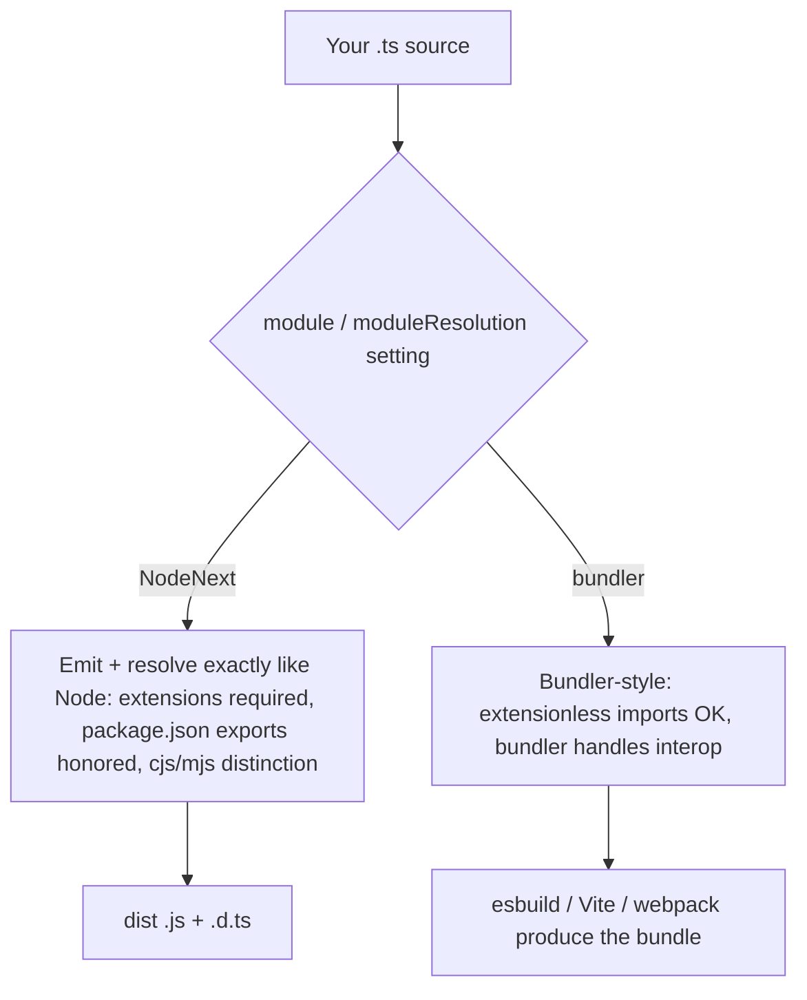
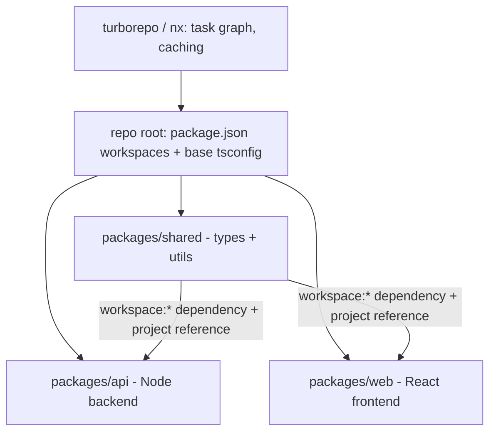

# Modules and Tooling

Real-world TypeScript pain is disproportionately tooling pain: ESM vs CommonJS interop, module resolution settings, declaration files, and build pipelines. Interviewers for senior and platform roles ask about these because they reveal production experience — anyone can write types, but shipping a typed package or untangling a "require of ES Module" error takes battle scars.

## ES Modules vs CommonJS

JavaScript has two module systems that TypeScript must bridge:

```typescript
// CommonJS (Node's original): synchronous, dynamic
const express = require("express");   // value at runtime
module.exports = { handler };

// ES Modules (the standard): static, analyzable, async-capable
import express from "express";
export const handler = () => {};
```

| Aspect | CommonJS | ES Modules |
|--------|----------|------------|
| Loading | Synchronous `require` | Static `import` (+ dynamic `import()`) |
| Analysis | Runtime only | Static — enables tree-shaking |
| File hint (Node) | `.cjs` / `"type": "commonjs"` | `.mjs` / `"type": "module"` |
| Top-level await | ❌ | ✅ |
| Interop direction | can `import()` ESM (async only) | can often import CJS |

### Interop Pain Points

```typescript
// ❌ Classic failure: a CJS default export imported as ESM
// CJS: module.exports = function connect() {}
import connect from "cjs-lib";      // works only with esModuleInterop
import * as ns from "cjs-lib";      // ns is the exports object, NOT callable per spec

// tsconfig fixes:
// "esModuleInterop": true      -> synthesizes default imports for CJS
// "allowSyntheticDefaultImports": true (type-level only)

// ❌ ERR_REQUIRE_ESM: a CJS file require()-ing an ESM-only package (chalk 5,
// node-fetch 3...). Fixes: migrate to ESM, use dynamic import(), or pin the
// older CJS version.

// Module resolution: "moduleResolution": "bundler" for bundled apps,
// "NodeNext" for code that Node itself runs. NodeNext REQUIRES file
// extensions in relative imports:
import { helper } from "./helper.js";  // yes, .js — you reference the OUTPUT file
```



## import type and Erasure-Safe Imports

```typescript
import type { User } from "./models";        // erased entirely at emit
import { type Config, loadConfig } from "./config"; // inline type modifier

// Why it matters:
// 1. Avoids emitting a require/import for modules only needed for types
//    (breaks otherwise with side-effectful modules or circular deps).
// 2. Required knowledge for single-file transpilers (esbuild, swc, tsx):
//    with "verbatimModuleSyntax": true, TS forces you to mark type-only
//    imports so each file can be compiled in isolation.
```

## Declaration Files (.d.ts)

Declaration files describe the types of JavaScript code — they contain no implementations.

```typescript
// math-utils.d.ts — typing an untyped JS library
declare module "math-utils" {
  export function add(a: number, b: number): number;
  export const VERSION: string;
}

// Global augmentation from a module file:
declare global {
  interface Window { analytics: { track(event: string): void } }
}
export {}; // make this file a module so 'declare global' is legal

// Ambient declarations for non-code imports (bundler features):
declare module "*.svg" {
  const url: string;
  export default url;
}
```

Where types come from, in resolution order: bundled types (`"types"` field in the package's package.json, or sibling `.d.ts` files) → `@types/*` packages from DefinitelyTyped → your own declarations. `skipLibCheck: true` skips type-checking inside all `.d.ts` files — near-universal in real projects to dodge third-party type conflicts.

## Publishing a Typed Package

```jsonc
// package.json for a dual-format (ESM+CJS) typed library
{
  "name": "my-lib",
  "type": "module",
  "exports": {
    ".": {
      "types": "./dist/index.d.ts",   // types condition FIRST
      "import": "./dist/index.js",
      "require": "./dist/index.cjs"
    }
  },
  "files": ["dist"]
}
```

Checklist: enable `"declaration": true` (and ideally `"declarationMap": true` for go-to-source), point `exports` conditions at the right artifacts, and validate with **arethetypeswrong** (`attw`) — the community tool that catches ESM/CJS/type mismatches. Tools like `tsup` or `unbuild` automate dual builds. Common interview-worthy failure: shipping ESM-only while consumers `require()` it, or `types` resolving to the wrong format's declarations.

## Compilers and Bundlers at a Glance

| Tool | Role | Type-checks? |
|------|------|--------------|
| `tsc` | Reference compiler; best for emitting `.d.ts` and CI checking | ✅ |
| esbuild / swc | Fast transpile + bundle (Vite, Next.js use them) | ❌ strips types only |
| Vite | Dev server + build on esbuild/Rollup | ❌ (run `tsc --noEmit` separately) |
| webpack + ts-loader/babel | Legacy but ubiquitous bundling | optional |
| tsup | Zero-config library bundler (esbuild) | via tsc for d.ts |

The standard production setup: a fast transpiler does the building, and `tsc --noEmit` runs in CI as the type gate. This split is why `isolatedModules`/`verbatimModuleSyntax` exist — every file must be transpilable without cross-file type information.

### Running TS Directly: ts-node and tsx

```bash
npx tsx src/script.ts        # esbuild-based, fast, ESM-friendly — the modern default
npx ts-node src/script.ts    # tsc-based, type-checks by default, slower
node --experimental-strip-types src/script.ts  # Node 22+: built-in type stripping
```

Node's built-in stripping only removes erasable syntax — `enum`, namespaces with values, and parameter properties are rejected (see guides 1 and 8).

## Linting: ESLint + typescript-eslint

```jsonc
// eslint.config.js (flat config) — the important part is type-aware linting
// extends: typescript-eslint 'recommendedTypeChecked'
// parserOptions: { projectService: true }  -> rules can see actual types
```

Highest-value type-aware rules: `no-floating-promises`, `no-misused-promises`, `await-thenable`, `no-unsafe-assignment` (tracks `any` leakage), `no-unnecessary-condition`. Type-aware linting is slower (it runs the checker) but catches real bugs plain ESLint cannot. Prettier (or Biome) handles formatting; keep formatting out of ESLint.

## Monorepo Basics



Key pieces: package-manager **workspaces** (pnpm/npm/yarn) link local packages; TypeScript **project references** (`"composite": true`, `references: [...]`, build with `tsc -b`) give incremental builds and enforce dependency direction; a shared `tsconfig.base.json` keeps compiler options consistent; Turborepo/Nx add task orchestration and caching. The big win for interviews: shared types (API contracts, domain models) live in one package imported by both frontend and backend — no drift.

## Real-World Applications

- Full-stack type safety: a `packages/contracts` workspace with zod schemas consumed by an Express API and a React app.
- Library authorship: dual ESM/CJS builds with `tsup` + `attw` verification — the standard for anything published to npm.
- CI pipelines: `tsc --noEmit && eslint . && vitest run` as the canonical quality gate.

## Best Practices

- New projects: `"type": "module"`, `moduleResolution: "bundler"` for apps, `NodeNext` for anything Node executes directly.
- Turn on `verbatimModuleSyntax` so type-only imports are explicit and every tool can transpile files in isolation.
- Let esbuild/swc/Vite build; run `tsc --noEmit` in CI as the type gate — never skip the gate just because the bundler succeeded.
- Ship `types` via the `exports` map, validate with arethetypeswrong before publishing.
- Adopt typescript-eslint's type-checked preset; `no-floating-promises` alone pays for the setup.
- In monorepos, put shared contracts in their own package and enforce boundaries with project references.

## Interview Questions

<details>
<summary>1. What are the key differences between CommonJS and ES modules?</summary>

CJS (`require`/`module.exports`) loads synchronously and resolves dynamically at runtime — you can `require` inside an if-statement. ESM (`import`/`export`) has static syntax analyzable before execution (enabling tree-shaking and better tooling), supports top-level await and async loading, and is the ECMAScript standard. In Node, `package.json` `"type"` and file extensions (`.cjs`/`.mjs`) choose the system per file. Interop is asymmetric: ESM can usually import CJS, but CJS can only load ESM via dynamic `import()` (historically — newer Node versions can `require` some synchronous ESM).
</details>

<details>
<summary>2. What does esModuleInterop actually fix?</summary>

CJS modules export a single object, not a "default export"; per spec, `import lib from "cjs"` should give `exports.default`, which most CJS libraries don't have. `esModuleInterop` adds emit-time helpers that treat the whole CJS exports object as the default import when no `__esModule` marker is present, making `import express from "express"` work as intuitively expected. It also fixes `import * as ns` misuse (a namespace object isn't callable). `allowSyntheticDefaultImports` is the type-checking half only, for bundlers that do the interop themselves.
</details>

<details>
<summary>3. Why does import type exist, and what does verbatimModuleSyntax enforce?</summary>

Types are erased, so an import used only for types should produce no runtime import — otherwise you get needless (possibly side-effectful or circular) module loads, and single-file transpilers like esbuild can't know whether to keep the import without cross-file type info. `import type` (and inline `type` modifiers) marks such imports explicitly for full erasure. `verbatimModuleSyntax` makes this mandatory and literal: value imports are kept exactly as written, type imports must be marked — guaranteeing each file transpiles correctly in isolation.
</details>

<details>
<summary>4. What is a .d.ts file and when do you write one by hand?</summary>

A declaration file contains only type information — module shapes, function signatures, globals — describing JavaScript that exists elsewhere. Compilers generate them from your TS (`declaration: true`) for consumers. You write them by hand to: type an untyped JS dependency (`declare module "lib"`), declare globals injected by scripts (`declare global`), describe non-code imports (`declare module "*.css"`), or author types for a JS library published to DefinitelyTyped (`@types/*`).
</details>

<details>
<summary>5. How do you correctly publish a package with types for both ESM and CJS consumers?</summary>

Build both formats (e.g. tsup emitting `index.js` ESM + `index.cjs`), emit declarations, and wire the package.json `exports` map with conditions — `types` first, then `import` and `require` pointing at the matching artifacts (ideally with per-format declarations, `.d.ts`/`.d.cts`, because declaration files have formats too). Include only `dist` in `files`, and verify with `arethetypeswrong`, which detects the classic failures: masquerading formats, missing `types` condition, and declarations that resolve to the wrong module kind.
</details>

<details>
<summary>6. Your bundler builds fine but the code is broken. How is that possible, and what's the standard setup?</summary>

esbuild/swc (and Vite dev) *strip* types without type-checking — they will happily bundle code with type errors, missing properties, wrong arguments. Type safety only exists where the checker runs. Standard setup: the bundler owns the build for speed; `tsc --noEmit` runs in CI (and ideally pre-push) as the authoritative type gate; the editor gives interactive feedback via the same tsserver. `isolatedModules`/`verbatimModuleSyntax` ensure nothing in the code requires cross-file type knowledge to transpile.
</details>

<details>
<summary>7. What are TypeScript project references and why do monorepos use them?</summary>

References (`composite: true` + a `references` array, built with `tsc -b`) declare compile-time dependencies between sub-projects. Benefits: incremental builds (unchanged packages are skipped via `.tsbuildinfo`), enforced boundaries (importing a package not listed in references errors), and consumers type-check against the dependency's emitted `.d.ts` rather than re-checking its source — faster and closer to how the published package behaves. Combined with workspaces (which handle runtime linking), they make shared-types packages practical at scale.
</details>

<details>
<summary>8. When would you choose tsx over ts-node, and what can Node's built-in type stripping run?</summary>

`tsx` transpiles with esbuild: near-instant startup, seamless ESM and CJS, watch mode — but no type checking, so pair it with `tsc --noEmit`. `ts-node` uses the real compiler (type-checks by default) but is slower and historically fiddly with ESM. Node 22+'s built-in stripping (`--experimental-strip-types`) runs TypeScript with zero dependencies, but only *erasable* syntax: `enum`, runtime namespaces, and parameter properties are rejected (that's the `erasableSyntaxOnly` flag's purpose), and it performs no type checking.
</details>
