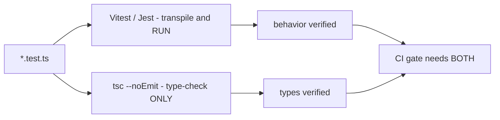

# Testing in TypeScript

Testing TypeScript has two layers: testing runtime behavior (Jest/Vitest, with the extra wrinkle of typing mocks) and testing the types themselves (expect-type, tsd) — because a library whose types regress is broken for users even if every runtime test passes. Interviews for product and platform roles probe both, plus the discipline questions: what to mock, what to assert, how to keep tests honest.

## Jest and Vitest with TypeScript

**Vitest** is the modern default for TS projects: it transpiles TS natively via esbuild (no transform config), shares config with Vite, and mirrors Jest's API. **Jest** needs a transform (`ts-jest` for type-checked runs, or the faster `@swc/jest`/`babel-jest` which strip types without checking).

```typescript
// vitest.config.ts
import { defineConfig } from "vitest/config";
export default defineConfig({
  test: {
    globals: false,        // prefer explicit imports — better for types
    coverage: { provider: "v8" },
  },
});
```

```typescript
// price.test.ts
import { describe, it, expect } from "vitest";
import { applyDiscount } from "./price";

describe("applyDiscount", () => {
  it("applies a percentage discount", () => {
    expect(applyDiscount(200, 0.1)).toBe(180);
  });

  it("rejects negative prices", () => {
    expect(() => applyDiscount(-1, 0.1)).toThrow(RangeError);
  });
});
```

Remember: test runners using esbuild/swc do **not** type-check your tests. Keep `tsc --noEmit` covering test files in CI, or type errors in tests rot silently.



## Typing Mocks

The chronic pain point: mocks are runtime objects, and keeping them type-safe requires deliberate technique.

```typescript
import { vi, it, expect, type Mock } from "vitest";

// 1. Typed function mocks
const fetchUser = vi.fn<(id: string) => Promise<User>>();
fetchUser.mockResolvedValue({ id: "1", name: "Ada" });   // ✅ checked!
// fetchUser.mockResolvedValue({ id: 1 });               // ❌ type error — good

// 2. Mocking a module, keeping types
import { sendEmail } from "./email";
vi.mock("./email");
const mockedSend = vi.mocked(sendEmail);   // Mock with sendEmail's exact signature
mockedSend.mockResolvedValue({ delivered: true });

it("notifies the user", async () => {
  await notifyUser("u1");
  expect(mockedSend).toHaveBeenCalledWith(
    expect.objectContaining({ to: expect.any(String) })
  );
});
```

```typescript
// 3. Interface fakes — structural typing is your friend
interface UserRepo {
  byId(id: string): Promise<User | null>;
  save(user: User): Promise<void>;
}

// Any object with the right shape satisfies the interface — no library needed:
function makeFakeRepo(seed: User[] = []): UserRepo {
  const store = new Map(seed.map((u) => [u.id, u]));
  return {
    async byId(id) { return store.get(id) ?? null; },
    async save(u) { store.set(u.id, u); },
  };
}

// 4. Partial mocks — contain the assertion blast radius
const repo = { byId: vi.fn().mockResolvedValue(null) } as unknown as UserRepo;
// ⚠️ The double assertion is a lie-with-a-license: fine in tests IF the code
// under test only calls byId. If it calls save, you get a runtime crash the
// types didn't warn about — prefer complete fakes for anything non-trivial.
```

Design lesson worth stating in interviews: constructor-injected dependencies typed as interfaces (guide 8) make mocking trivial via structural typing, often eliminating module-mocking machinery entirely.

## Testing Types Themselves

Type-level code (generics, conditional types, public API signatures) needs its own tests — a type regression breaks consumers with zero failing runtime tests.

```typescript
// 1. Vitest's built-in expectTypeOf (from expect-type)
import { expectTypeOf, test } from "vitest";
import { pluck } from "./utils";

test("pluck types", () => {
  const users = [{ id: 1, name: "Ada" }];
  expectTypeOf(pluck(users, "id")).toEqualTypeOf<number[]>();
  expectTypeOf(pluck).parameter(1).toEqualTypeOf<"id" | "name">();
  // Negative test: wrong keys must be rejected
  // @ts-expect-error — "age" is not a key of the element type
  pluck(users, "age");
});
// Run with: vitest --typecheck  (these assertions are checked by tsc, not at runtime)
```

```typescript
// 2. tsd — for published libraries (test the .d.ts consumers actually get)
// index.test-d.ts
import { expectType, expectError } from "tsd";
import { parseRoute } from ".";

expectType<{ userId: string }>(parseRoute("/users/:userId"));
expectError(parseRoute(42));
```

Two idioms to know:

- `// @ts-expect-error` — asserts the *next line fails to compile*; if it starts compiling (a regression toward permissiveness), the directive itself errors. Prefer it over `@ts-ignore`, which silences errors unconditionally.
- Assignability tricks like `type Assert<T extends true> = T` with an `Equal<A, B>` helper — how the type-challenges project tests solutions without any library.

## Testing Best Practices (TypeScript-Flavored)

```typescript
// ❌ Don't weaken types to make tests compile
const user = { name: "Ada" } as any as User;   // hides missing required fields

// ✅ Use factory functions with overridable defaults
function buildUser(overrides: Partial<User> = {}): User {
  return { id: "u1", name: "Ada", email: "ada@example.com", ...overrides };
}
const admin = buildUser({ role: "admin" });    // intent-revealing, type-safe

// ✅ Validate unknown data in tests exactly as in prod code
const body: unknown = await res.json();
const parsed = UserSchema.parse(body);         // zod: runtime + type in one step
```

Further discipline points:

- **Arrange-Act-Assert** with one behavior per test; name tests by behavior ("rejects expired tokens"), not by method name.
- **Test the public contract**, not private internals — structural typing tempts you to reach into objects; resist it.
- **Avoid over-mocking**: mock at architectural boundaries (network, clock, filesystem) and prefer real implementations or in-memory fakes inward of them. Use `vi.useFakeTimers()` for time, MSW for HTTP.
- **Async correctness**: always `await` the code under test; Vitest fails on unhandled rejections, but a missing `await` can still pass vacuously. `expect(promise).rejects.toThrow(...)` needs its own `await`.
- **Coverage** is a map of what is untested, not a target to game; branch coverage on narrowing-heavy code (discriminated unions) is the meaningful metric.

## Real-World Applications

- Library authors (zod, tRPC, TanStack Query) ship extensive `expectTypeOf`/tsd suites — their type inference *is* the product.
- Backend teams pair Vitest unit tests with typed integration tests using testcontainers, sharing zod schemas between prod validation and test assertions.
- Frontend teams use Testing Library with TS: typed queries (`getByRole`) push tests toward accessible, resilient selectors.

## Best Practices

- Choose Vitest for new projects; if on Jest, use `@swc/jest` for speed and keep `tsc --noEmit` in CI for checking.
- Never let `any` into tests to "make it compile" — use factories with `Partial<T>` overrides and complete fakes.
- Prefer dependency injection + structural fakes over module mocking; reserve `vi.mock` for true edges.
- Use `vi.mocked()` / typed `vi.fn<...>()` so mock setup and assertions are compiler-checked.
- Add type tests (`expectTypeOf` + `@ts-expect-error` negatives) for every exported generic utility.
- Run behavior tests and the type gate as separate CI steps so both failure modes are visible.

## Interview Questions

<details>
<summary>1. Does Jest or Vitest type-check your tests? What are the implications?</summary>

Generally no. Vitest transpiles with esbuild and Jest with swc/babel typically — both strip types without checking (ts-jest can check, at a speed cost). Implication: tests full of type errors can pass, and type regressions go unnoticed unless `tsc --noEmit` includes test files in CI. The standard setup is two parallel gates: the runner verifies behavior, tsc verifies types, and both must pass.
</details>

<details>
<summary>2. How do you create a type-safe mock of a function or module?</summary>

For functions: `vi.fn<(id: string) => Promise<User>>()` (or `jest.fn` with generics) so `mockResolvedValue` and call assertions are checked against the real signature. For modules: `vi.mock("./mod")` then `vi.mocked(importedFn)` wraps the import with mock methods while preserving its parameter and return types. For interfaces: leverage structural typing — hand-write an in-memory fake object implementing the interface; the compiler guarantees completeness, no library required.
</details>

<details>
<summary>3. Why and how would you test types themselves?</summary>

Because for generic utilities and library APIs the inference behavior is the contract: a change that widens a return type to `any` or rejects a valid call breaks users with all runtime tests green. Tools: `expectTypeOf` (Vitest built-in) / `expect-type` for source-level assertions like `toEqualTypeOf`, `tsd` for testing published `.d.ts` output, and `// @ts-expect-error` for negative cases (this call MUST fail). These run in the type-checking phase (`vitest --typecheck`), not at runtime.
</details>

<details>
<summary>4. What is the difference between @ts-expect-error and @ts-ignore?</summary>

Both suppress a compile error on the following line, but `@ts-expect-error` additionally *asserts* an error exists — if the line compiles cleanly, the directive itself becomes an error. That makes it self-maintaining: fix the underlying issue and the compiler forces you to delete the directive, and in type tests it verifies invalid usage stays invalid. `@ts-ignore` silences unconditionally and rots. Rule: `@ts-expect-error` (ideally with a comment) or nothing.
</details>

<details>
<summary>5. How does structural typing change your mocking strategy compared to Java/C#?</summary>

In nominal languages, substituting a dependency needs the mock to formally implement the interface, usually via a mocking framework generating proxies. In TS, any object literal with the right shape satisfies the interface — so a hand-rolled fake (`{ byId: async () => null, save: async () => {} }`) type-checks immediately. This makes lightweight in-memory fakes cheap and idiomatic, reduces reliance on module-mocking, and rewards designing code with interface-typed constructor injection.
</details>

<details>
<summary>6. What are the risks of partial mocks cast with `as unknown as T`?</summary>

The double assertion tells the compiler the incomplete object is a full `T`, so nothing verifies you stubbed everything the code under test touches — a call to an omitted method crashes at runtime with a confusing error, and refactors adding interface members won't flag the stale mock. Acceptable for tightly scoped tests where the used surface is obvious; for anything else prefer complete fakes (compiler-verified) or `satisfies Partial<T>` on the stub plus a builder that fills defaults.
</details>

<details>
<summary>7. How do you test async code correctly in Vitest/Jest?</summary>

Make the test function async and `await` everything: the operation itself, and rejection assertions — `await expect(doThing()).rejects.toThrow(AuthError)`. A missing await can let the test pass before the assertion runs or leak an unhandled rejection into another test. For time-based logic use fake timers (`vi.useFakeTimers()` + `vi.advanceTimersByTimeAsync`) rather than real sleeps; for HTTP prefer MSW-style network interception over mocking your own fetch wrapper, so serialization and error paths are exercised.
</details>

<details>
<summary>8. Where should mocking stop — what should stay real in a good TS test suite?</summary>

Mock at system boundaries you don't own or can't run fast: network, clock, randomness, filesystem, third-party SaaS. Keep your own domain logic, mappers, and validators real — mocking them couples tests to implementation and lets integration bugs (schema drift, wrong wiring) through. In-memory fakes for repositories hit a sweet spot: fast, deterministic, behavior-bearing. A layered suite — many unit tests, a band of integration tests with real DB via containers, few end-to-end — plus shared zod schemas keeps runtime and types aligned across layers.
</details>
