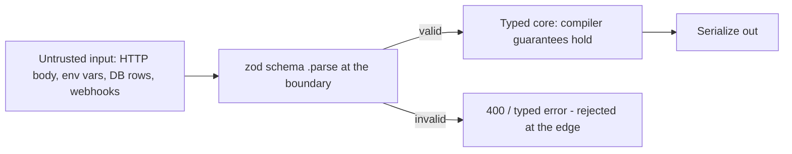

# TypeScript Best Practices and Ecosystem

Knowing TypeScript's features is table stakes; senior interviews ask how you *run* TypeScript in production — strictness policy, where `any` is tolerable, how you validate data at trust boundaries given type erasure, and how errors flow through a typed codebase. This guide collects the practices that mark an experienced TypeScript engineer and surveys where TS dominates the industry.

## Strictness-First Configuration

Start maximally strict; loosening later is easy, tightening a lax codebase is a months-long migration.

```jsonc
{
  "compilerOptions": {
    "strict": true,                        // the umbrella — non-negotiable
    "noUncheckedIndexedAccess": true,      // arr[i]: T | undefined — honest lookups
    "exactOptionalPropertyTypes": true,    // { x?: number } ≠ { x: number | undefined }
    "noImplicitOverride": true,            // require `override` keyword
    "noFallthroughCasesInSwitch": true,
    "verbatimModuleSyntax": true,          // explicit type-only imports
    "noEmitOnError": true
  }
}
```

For legacy migrations, ratchet: enable flags one at a time, fix or `@ts-expect-error`-annotate violations, and forbid new ones via CI. Tools like `typescript-strict-plugin` and betterer support per-file ratcheting.

## Avoiding any — and Where It Is Fine

```typescript
// ❌ any silently propagates and disables checking downstream
function handle(data: any) {
  return data.user.name.toUpperCase(); // no checks whatsoever
}

// ✅ unknown forces narrowing at the point of use
function handleSafe(data: unknown) {
  const parsed = UserSchema.safeParse(data);
  return parsed.success ? parsed.data.name.toUpperCase() : null;
}
```

Legitimate `any` (know these — "never use any" is a junior answer):

- **Generic constraint plumbing**: `T extends (...args: any[]) => any` — here `any` in a constraint position doesn't leak into user code.
- **Truly untypeable interop** at a boundary you immediately wrap with a typed, validated API.
- **Test scaffolding** in tightly-scoped spots (still prefer factories).

Contain it: `@typescript-eslint/no-explicit-any` plus the `no-unsafe-*` rules flag leaks; `unknown` is the default for "I don't know yet".

## Runtime Validation at Boundaries

Types erase (guide 1), so compile-time types say **nothing** about runtime data from the network, environment, files, or users. Validate at every trust boundary and derive the static type from the validator — a single source of truth.



```typescript
import { z } from "zod";

const CreateUserSchema = z.object({
  name: z.string().min(1),
  email: z.string().email(),
  age: z.number().int().positive().optional(),
});

// The static type is DERIVED from the schema — no drift possible:
type CreateUser = z.infer<typeof CreateUserSchema>;

app.post("/users", (req, res) => {
  const result = CreateUserSchema.safeParse(req.body); // req.body is unknown!
  if (!result.success) {
    return res.status(400).json({ errors: result.error.flatten() });
  }
  const user: CreateUser = result.data;  // ✅ now the types are TRUE
  // ...
});

// Same idea for environment config at startup:
const Env = z.object({
  DATABASE_URL: z.string().url(),
  PORT: z.coerce.number().default(3000),
}).parse(process.env);   // crash at boot, not at 3 a.m. mid-request
```

Ecosystem: zod dominates; valibot (smaller bundles), ArkType (performance), typia (compile-time generated validators) are alternatives; Standard Schema is an emerging common interface. tRPC, react-hook-form, and OpenAPI generators all integrate schema-first validation.

## Error Handling Patterns

```typescript
// 1. catch takes unknown — normalize before use
function toError(e: unknown): Error {
  return e instanceof Error ? e : new Error(String(e));
}

// 2. Custom error classes with a discriminant for domain failures
class NotFoundError extends Error {
  readonly kind = "not_found" as const;
  constructor(public readonly resource: string) {
    super(`${resource} not found`);
  }
}

// 3. Result types: make EXPECTED failures part of the signature.
// Thrown exceptions are invisible in types; a Result is not.
type Result<T, E> = { ok: true; value: T } | { ok: false; error: E };

type ParseError = { kind: "invalid_json" } | { kind: "schema"; issues: string[] };

function parseConfig(raw: string): Result<Config, ParseError> {
  let json: unknown;
  try {
    json = JSON.parse(raw);
  } catch {
    return { ok: false, error: { kind: "invalid_json" } };
  }
  const parsed = ConfigSchema.safeParse(json);
  return parsed.success
    ? { ok: true, value: parsed.data }
    : { ok: false, error: { kind: "schema", issues: parsed.error.issues.map(String) } };
}

// Callers are FORCED to consider failure — it's a discriminated union:
const r = parseConfig(raw);
if (!r.ok) return renderError(r.error);   // exhaustive handling available
useConfig(r.value);
```

Guideline: **throw** for bugs and unrecoverable states (programmer errors); **return Results** for expected, recoverable failures (validation, not-found, business rules). Libraries like neverthrow formalize this; `Promise<Result<T, E>>` keeps async signatures honest where `Promise<T>` hides every failure mode.

## TypeScript on the Backend (Node.js)

```typescript
// Fastify with full type inference — the modern Node stack in miniature
import Fastify from "fastify";

const app = Fastify();

app.get<{ Params: { id: string } }>("/users/:id", async (req, reply) => {
  const user = await users.byId(req.params.id);   // params typed!
  if (!user) return reply.code(404).send({ message: "not found" });
  return user;                                    // return type checked
});
```

The dominant stack: Node (or Bun/Deno — TS-first runtimes) + Fastify/Express/NestJS + Prisma/Drizzle (schema-derived query types) + zod at the edges + tRPC or OpenAPI for contracts. The killer feature is **end-to-end type safety**: DB schema → ORM types → service layer → API contract → frontend client, with breaking changes surfacing as compile errors across the whole chain (especially in a monorepo, guide 9).

## TypeScript on the Frontend (React)

```tsx
// Typed props with a discriminated union — impossible states unrepresentable
type ButtonProps =
  | { variant: "link"; href: string; onClick?: never }
  | { variant: "button"; onClick: () => void; href?: never };

function Button(props: ButtonProps) {
  return props.variant === "link"
    ? <a href={props.href}>Go</a>
    : <button onClick={props.onClick}>Go</button>;
}

// Generic components — typed rows end to end
function Table<Row>({ rows, render }: { rows: Row[]; render: (r: Row) => React.ReactNode }) {
  return <ul>{rows.map((r, i) => <li key={i}>{render(r)}</li>)}</ul>;
}

// Typed hooks: useState<T>, and reducers over discriminated-union actions
```

React + TS is the industry-default frontend pairing (the official React docs assume it); Angular is TS-native; Vue ships first-class TS support. TanStack Query, Redux Toolkit, and react-hook-form are all designed around inference.

## Where TypeScript Dominates in Industry

- **Frontend**: the default for new React/Angular/Vue work; virtually all serious component libraries and design systems are TS.
- **Backend services**: Node/NestJS/Fastify microservices; serverless functions (Lambda, Cloudflare Workers — Workers' API is TS-first).
- **Full-stack frameworks**: Next.js, Remix, SvelteKit, Nuxt — all TS-first with typed routing/data loading.
- **Tooling and infra**: VS Code, the TS compiler itself, Pulumi/CDK (infrastructure as typed code), many CLIs.
- **Cross-platform**: React Native, Electron, Expo.

Interview-worthy trend lines: runtimes embracing TS directly (Bun, Deno, Node type stripping), the TS compiler's Go rewrite (announced 2025) targeting ~10x speedups, and schema-first end-to-end typing (tRPC, zod, OpenAPI codegen) as standard architecture.

## Best Practices

- Adopt `strict: true` + `noUncheckedIndexedAccess` from day one; ratchet legacy code one flag at a time.
- Default to `unknown` over `any`; allow `any` only in constraint positions and wrapped interop, enforced by lint.
- Parse, don't validate-and-cast: derive types from zod schemas at every trust boundary (HTTP, env, queues, DB edges).
- Throw for bugs; return `Result` discriminated unions for expected failures; normalize `catch (e: unknown)` with a `toError` helper.
- Model UI and domain state as discriminated unions; use `satisfies` to check values against types without widening them.
- Share contract types (or better, schemas) between client and server in a monorepo package to eliminate drift.

## Interview Questions

<details>
<summary>1. Types are erased at runtime — so how do you actually get safety for API input?</summary>

Compile-time types constrain your code, not the outside world: `req.body` typed as `CreateUser` is an unchecked assumption. The fix is runtime validation at every trust boundary — parse input with a schema library (zod), reject on failure, and *derive* the static type from the schema (`z.infer`) so runtime checks and compile-time types can never drift. Inside the validated boundary, the compiler's guarantees are then genuinely true. This "parse, don't validate" pattern is standard on Node backends and for env-var config at process startup.
</details>

<details>
<summary>2. When is any acceptable, and how do you keep it from spreading?</summary>

Acceptable: constraint positions in generic plumbing (`T extends (...args: any[]) => any`), narrowly wrapped interop with untypeable JS, and occasionally test scaffolding. Everywhere else prefer `unknown`, which is equally flexible to *store* but demands narrowing to *use*. Containment: `noImplicitAny` (in strict), typescript-eslint's `no-explicit-any` and `no-unsafe-assignment/call/member-access/return` rules, which track `any` leaking through a codebase, and code review treating each `any` as requiring justification.
</details>

<details>
<summary>3. Compare throwing exceptions with returning Result types in TypeScript.</summary>

Thrown exceptions are invisible to the type system — `Promise<User>` says nothing about the five ways it can reject, callers forget handlers, and `catch` gives you `unknown`. A `Result<T, E>` discriminated union puts failure in the signature: callers must check `ok` before touching the value, error variants are exhaustive-checkable, and refactors that add failure modes break compilation helpfully. Costs: ceremony (mitigated by helpers/neverthrow) and impedance with throwing ecosystems. Sensible split: Results for expected domain failures; exceptions for bugs and unrecoverable conditions, caught at a top-level boundary.
</details>

<details>
<summary>4. What does the satisfies operator do that a type annotation doesn't?</summary>

`const cfg = {...} satisfies Config` *checks* the value against `Config` while keeping the value's own narrower inferred type. An annotation `const cfg: Config = {...}` widens: property literal types become the declared ones, and extra inference is lost — `cfg.mode` would be `"dark" | "light"` rather than the actual `"dark"`. `satisfies` gives validation plus precision, ideal for config objects, route maps, and theme definitions where you want both conformance and literal key/value inference downstream.
</details>

<details>
<summary>5. How would you introduce TypeScript into a large JavaScript codebase?</summary>

Incrementally: enable `allowJs` + `checkJs` to type-check JS via JSDoc first; convert files to `.ts` starting from the dependency leaves (utilities, models) toward entry points; begin with looser flags and ratchet strictness per-flag (or per-directory with project references), tracking suppressed errors with `@ts-expect-error` and burning them down; add `.d.ts` files or `@types` packages for untyped dependencies; wire `tsc --noEmit` into CI immediately so converted code never regresses. Prioritize typing the module boundaries and shared contracts — they yield the most cross-file error detection per hour invested.
</details>

<details>
<summary>6. Why do teams derive types from zod schemas instead of writing interfaces plus validators separately?</summary>

Separate interface + hand-written validator is two sources of truth that drift: add a field to the interface, forget the validator, and the type system happily lies about runtime data. `z.infer<typeof Schema>` makes the schema the single source: the validator and the static type update atomically, refactors propagate, and the schema doubles as documentation, form validation, and OpenAPI source. The inverse direction (types → generated validators, e.g. typia) achieves the same single-source property.
</details>

<details>
<summary>7. What is end-to-end type safety and how is it achieved in practice?</summary>

The property that a data-shape change anywhere in the stack surfaces as compile errors everywhere it matters — DB to browser. Practical recipe: schema-deriving ORM (Prisma/Drizzle generates row types from schema), service and API layers typed from those models, a contract layer shared with the frontend — either tRPC (server routers' inferred types imported directly by the client in a monorepo) or OpenAPI codegen for polyglot boundaries — plus zod at untrusted edges. Rename a column and the frontend fails to build; that failure is the feature.
</details>

<details>
<summary>8. Which strict-family flags beyond `strict: true` do you enable, and why?</summary>

`noUncheckedIndexedAccess` — index/record lookups become `T | undefined`, eliminating the most common false confidence in strict TS. `exactOptionalPropertyTypes` — distinguishes an absent property from one explicitly set to `undefined`, which matters for spread-based updates and JSON semantics. `noImplicitOverride` — refactor safety for class hierarchies. `noFallthroughCasesInSwitch` and `noPropertyAccessFromIndexSignature` for bug-prone patterns; `verbatimModuleSyntax` for tooling correctness. They're separate from `strict` mainly for historical/back-compat reasons, not because they're less valuable on new code.
</details>
