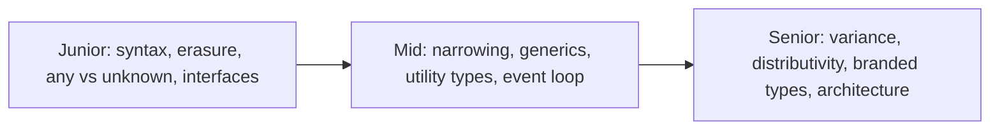

# TypeScript Interview Questions

A curated bank of 34 TypeScript interview questions with detailed answers, grouped by difficulty. Junior questions test vocabulary and everyday syntax; mid-level questions test narrowing, generics, and utility types; senior questions test type-system semantics, variance, type-level programming, and architecture judgment. Practice answering out loud, and paste every code question into the TypeScript Playground to verify your predictions.



---

## Junior Level

<details>
<summary>1. What is TypeScript and what are its main benefits over JavaScript?</summary>

TypeScript is a statically typed superset of JavaScript that compiles to plain JavaScript. Benefits: compile-time error detection (typos, wrong arguments, null misuse caught before running), vastly better editor tooling (autocomplete, safe renames, inline docs — all powered by types), self-documenting APIs, safer large-scale refactoring, and support for modern ECMAScript features compiled down to older targets. The cost is a build step and a learning curve; the types themselves add zero runtime overhead because they are erased during compilation.
</details>

<details>
<summary>2. What happens to types when TypeScript compiles? Can you check a type at runtime?</summary>

All type annotations, interfaces, type aliases, and generics are erased — the emitted JavaScript contains no type information. Therefore you cannot check an interface at runtime: `x instanceof MyInterface` is a compile error because interfaces don't exist as values. Runtime checks must use JavaScript mechanisms: `typeof`, `instanceof` with classes, property checks, or schema validators like zod. (Historical exceptions that do emit code: `enum` and namespaces.)
</details>

<details>
<summary>3. Explain the difference between any, unknown, and never.</summary>

`any` opts out of type checking bidirectionally — you can assign anything to it and it to anything, and all operations on it compile; it silently spreads unsafety. `unknown` accepts any value but permits no operations until narrowed — the safe way to say "I don't know yet" (e.g. `JSON.parse` results, `catch` variables). `never` is the empty type: no value inhabits it; functions that always throw return it, and it appears after exhaustive narrowing, powering exhaustiveness checks. Assignability: everything → `unknown`; `never` → everything; `any` ↔ everything (that's the danger).
</details>

<details>
<summary>4. What is the difference between interface and type? When do you use each?</summary>

Both name object shapes and are implemented by classes. Interfaces support declaration merging (repeat declarations merge — enabling augmentation of `Window`, Express's `Request`) and `extends` with eager, clear conflict errors. Type aliases can express things interfaces cannot: unions, tuples, mapped/conditional types, and aliases of primitives. Intersections (`&`) resemble extends but silently collapse conflicting properties to `never` instead of erroring. Convention: `interface` for object shapes (especially public/extensible APIs), `type` for unions and computed types.
</details>

<details>
<summary>5. What are optional properties and optional parameters?</summary>

A `?` suffix makes a property or parameter omittable: `interface Opts { retries?: number }` means `retries` is `number | undefined` when read; `function f(x: number, y?: string)` allows one- or two-argument calls, with `y: string | undefined` in the body. Optional parameters must follow required ones. With `exactOptionalPropertyTypes`, TS additionally distinguishes "absent" from "explicitly set to undefined". Pitfall: bags of optional properties often model state badly — prefer discriminated unions when properties come and go together.
</details>

<details>
<summary>6. What is a union type and what can you do with a value of union type?</summary>

`string | number` is a value that is one of several types. Before narrowing, you may only use members common to all arms (e.g. `toString`). To use arm-specific members you narrow with type guards: `typeof x === "string"`, `instanceof`, `in`, equality checks, or a discriminant property. The compiler's control-flow analysis tracks these checks per branch, so inside `if (typeof x === "string")` the value is just `string`.
</details>

<details>
<summary>7. What does readonly do, and how is it different from const?</summary>

`const` prevents *rebinding a variable*; the object it references stays mutable (`const a = []; a.push(1)` is fine). `readonly` prevents *writing a property* through that type (`readonly id: string`) or using mutating methods (`readonly string[]` has no `push`). Both are compile-time only: `readonly` is erased and performs no `Object.freeze`. For literals, `as const` gives deep readonly plus literal-type inference. For runtime immutability you need `Object.freeze` or immutable data structures.
</details>

<details>
<summary>8. What are enums, and what is the commonly recommended alternative?</summary>

`enum` defines a named set of constants — but unlike almost all TS syntax it generates runtime code (an object; numeric enums also get reverse mappings). The modern alternative is a const object with a derived union: `const Status = { Active: "ACTIVE", Closed: "CLOSED" } as const; type Status = typeof Status[keyof typeof Status]`. This gives the same ergonomics with zero non-erasable emit (compatible with Node's type stripping and `erasableSyntaxOnly`), plain strings that interop with JSON/APIs, and better tree-shaking. If you do use enums, prefer string enums.
</details>

<details>
<summary>9. What is a tuple and when would you use one over an array?</summary>

A tuple types each position individually with a fixed length: `[number, string]`, optionally labeled `[id: number, name: string]`. Use it for heterogeneous, positional data: coordinate pairs, `[value, setter]` returns like React's `useState`, `Object.entries` pairs, CSV rows with known columns. Arrays (`T[]`) suit homogeneous collections of unknown length. Tuples support optional (`[number, string?]`) and rest (`[string, ...number[]]`) elements and can be `readonly`.
</details>

<details>
<summary>10. What is type assertion (as), and why is it risky?</summary>

`value as T` tells the compiler to treat `value` as type `T` — with no runtime conversion or check. It's needed when you know more than the compiler (e.g. `document.getElementById("canvas") as HTMLCanvasElement`). Risk: you can assert wrongly, and the compiler then reasons from a false premise; `x as unknown as Y` can force any lie through. Prefer narrowing with guards, and treat every `as` (and non-null `!`) as a code-review flag. Note `as` is also used in non-assertion roles: `as const` and mapped-type key remapping.
</details>

<details>
<summary>11. What does strict mode (strict: true) enable, and which flag matters most?</summary>

`strict` is an umbrella: `strictNullChecks`, `noImplicitAny`, `strictFunctionTypes`, `strictBindCallApply`, `strictPropertyInitialization`, `noImplicitThis`, `useUnknownInCatchVariables`, `alwaysStrict`. The most impactful is `strictNullChecks`: without it `null`/`undefined` are assignable to everything, reintroducing JavaScript's most common crash ("cannot read properties of undefined") that TypeScript exists to prevent. Second is `noImplicitAny`, which stops unannotated values silently becoming `any`.
</details>

<details>
<summary>12. Predict the output:</summary>

```typescript
console.log("a");
setTimeout(() => console.log("b"), 0);
Promise.resolve().then(() => console.log("c"));
console.log("d");
```

Output: `a, d, c, b`. Synchronous code runs first (`a`, `d`). When the stack empties, the event loop drains the entire microtask queue — promise reactions — so `c` runs before any macrotask. The `setTimeout` callback is a macrotask and runs last despite the 0ms delay. Rule: sync → all microtasks → one macrotask → (repeat).
</details>

---

## Mid Level

<details>
<summary>13. What is a discriminated union? Design one for a payment method.</summary>

A union of object types sharing a literal-typed discriminant property. Checking the discriminant narrows to the exact member:

```typescript
type PaymentMethod =
  | { kind: "card"; last4: string; expiry: string }
  | { kind: "mpesa"; phoneNumber: string }
  | { kind: "bank"; iban: string };

function describe(p: PaymentMethod): string {
  switch (p.kind) {
    case "card":  return `Card ending ${p.last4}`;
    case "mpesa": return `M-Pesa ${p.phoneNumber}`;
    case "bank":  return `Bank ${p.iban}`;
    default: {
      const _x: never = p; // exhaustiveness: adding a variant breaks compilation here
      throw new Error("unreachable");
    }
  }
}
```

Benefits: variant-specific fields only exist on their variant (illegal states unrepresentable), and the `never` default makes every switch fail to compile when a new variant is added — compiler-driven change management.
</details>

<details>
<summary>14. What is a type guard? Write a custom one and name its main risk.</summary>

A runtime check the compiler uses to narrow types: built-ins are `typeof`, `instanceof`, `in`, equality/truthiness, and discriminant checks. Custom guards use a type-predicate return:

```typescript
function isUser(v: unknown): v is User {
  return typeof v === "object" && v !== null &&
    typeof (v as User).id === "string";
}
```

If it returns true, the argument is narrowed to `User` at the call site. Risk: the body is essentially trusted — a predicate that checks the wrong things (or nothing) reintroduces unsoundness with a type-safe face. Unit-test guards, or generate them from schemas (zod's `.safeParse`) so check and type can't drift.
</details>

<details>
<summary>15. Implement Partial, Required, and Readonly from scratch.</summary>

```typescript
type MyPartial<T>  = { [K in keyof T]?: T[K] };
type MyRequired<T> = { [K in keyof T]-?: T[K] };
type MyReadonly<T> = { readonly [K in keyof T]: T[K] };
```

Each is a homomorphic mapped type: it iterates `keyof T`, copies each property's type via indexed access `T[K]`, and adds (`?`, `readonly`) or removes (`-?`) modifiers. Homomorphic mapping preserves the original modifiers otherwise. All are shallow — nested objects are untouched (hence `DeepPartial` as a follow-up).
</details>

<details>
<summary>16. Implement Pick and Omit from scratch, and explain Exclude's role.</summary>

```typescript
type MyPick<T, K extends keyof T> = { [P in K]: T[P] };
type MyExclude<T, U> = T extends U ? never : T;        // distributive conditional
type MyOmit<T, K extends PropertyKey> = MyPick<T, MyExclude<keyof T, K>>;
```

`Pick` maps over just the requested keys. `Exclude` uses distributivity: applied to the union `keyof T`, the conditional runs per member, mapping excluded keys to `never` (which vanishes in unions). `Omit` = Pick of the complement. Alternative `Omit` via key remapping: `{ [P in keyof T as P extends K ? never : P]: T[P] }`.
</details>

<details>
<summary>17. Implement DeepPartial. What edge cases would you mention?</summary>

```typescript
type DeepPartial<T> = T extends object
  ? { [K in keyof T]?: DeepPartial<T[K]> }
  : T;
```

Primitives pass through; objects get every property optionalized and recursed. Edge cases worth volunteering: arrays (you may want `DeepPartial<E>[]` via `T extends (infer E)[]` rather than partializing index signatures), functions (they match `extends object` — usually pass them through), built-ins like `Date`/`Map`/`Set` (should not be mapped), and recursion depth limits on very large types (`ts2589`).
</details>

<details>
<summary>18. Write a function typed so get(obj, key) returns the exact property type and rejects bad keys.</summary>

```typescript
function get<T, K extends keyof T>(obj: T, key: K): T[K] {
  return obj[key];
}
```

`K extends keyof T` constrains keys to the object's actual property names (typos fail to compile); `T[K]` — an indexed access type — returns that key's precise type, so `get(user, "age")` is `number`, not a union of all values. This trio (generic + `keyof` constraint + indexed access) is the foundation of typed `pluck`, form libraries, and ORM field selection.
</details>

<details>
<summary>19. What's the difference between unknown in a catch clause and typing your own errors? Show good error handling.</summary>

JS can throw anything, so `catch (e)` is `unknown` under strict mode — you must narrow before use:

```typescript
try {
  await charge(card);
} catch (e) {
  if (e instanceof PaymentError) return retryOrRefund(e);  // domain error
  if (e instanceof Error) logger.error(e.message, e.stack); // generic
  else logger.error("non-error thrown", { value: e });
  throw e; // rethrow bugs
}
```

For *expected* failures, many teams skip exceptions entirely and return a `Result` discriminated union (`{ ok: true; value } | { ok: false; error }`) so failure is visible in the signature and exhaustively handleable — exceptions remain for genuine bugs.
</details>

<details>
<summary>20. Predict the output and explain:</summary>

```typescript
async function foo() {
  console.log(1);
  await Promise.resolve();
  console.log(2);
}
console.log(3);
foo();
console.log(4);
```

Output: `3, 1, 4, 2`. `console.log(3)` runs first. Calling `foo()` executes its body *synchronously* until the first `await` — printing `1` — then suspends, scheduling the rest as a microtask. Control returns to the caller, printing `4`. The synchronous script ends; the microtask queue drains, printing `2`. Key facts: async functions start synchronously, and `await` yields to the event loop even for already-resolved promises.
</details>

<details>
<summary>21. Why does this compile but crash, and how do you prevent it?</summary>

```typescript
const scores: Record<string, number> = { ada: 90 };
const s = scores["grace"];
console.log(s.toFixed(1)); // 💥 TypeError: s is undefined
```

`Record<string, number>` claims every string key maps to a number, so lookups are typed `number` even for absent keys — a deliberate unsoundness for ergonomics. Fix: enable `noUncheckedIndexedAccess`, which types index reads as `number | undefined` and forces a check (`s?.toFixed(1)` or an `in`/`!== undefined` guard). Alternatively use a `Map` and handle `get`'s `undefined`, or type the object with known literal keys.
</details>

<details>
<summary>22. What does the satisfies operator do? Give a concrete case where an annotation is worse.</summary>

`satisfies` validates an expression against a type without changing the expression's inferred type.

```typescript
const routes = {
  home: "/",
  user: "/users/:id",
} satisfies Record<string, `/${string}`>;

routes.user; // type "/users/:id" — literal preserved!
// With `const routes: Record<string, string>` the annotation wins:
// routes.user would be just `string`, and routes.typo would type-check too.
```

Annotation widens to the declared type and admits any keys of that type; `satisfies` keeps exact keys and literal values (great for downstream inference) while still catching shape errors like a value that isn't a path.
</details>

<details>
<summary>23. Sequential vs parallel awaits — refactor this and discuss error behavior.</summary>

```typescript
// Before: ~300ms — three independent 100ms calls serialized
const user = await fetchUser(id);
const orders = await fetchOrders(id);
const prefs = await fetchPrefs(id);

// After: ~100ms — start all, await together, tuple stays typed
const [user2, orders2, prefs2] = await Promise.all([
  fetchUser(id), fetchOrders(id), fetchPrefs(id),
]);
```

`Promise.all` is fail-fast: the first rejection rejects the whole thing (other promises keep running but their results are dropped — beware unhandled work). If partial results matter, use `Promise.allSettled` and narrow each `PromiseSettledResult` (a discriminated union on `status`). Only serialize awaits when a real data dependency exists.
</details>

<details>
<summary>24. How do generics interact with inference? Why does longest("abc", [1,2]) fail for longest&lt;T extends {length: number}&gt;(a: T, b: T)?</summary>

TS infers `T` from all argument positions and needs one consistent type. `"abc"` proposes `string`, `[1,2]` proposes `number[]`; the best common candidate `string | number[]` may be tried in modern TS, but with the constraint and both parameters bound to one `T` the historical/likely outcome is an error (or a union you didn't intend). Fixes depend on intent: two type parameters (`<A extends Lengthy, B extends Lengthy>(a: A, b: B): A | B`) to allow mixing, or keep one `T` precisely to *forbid* mixing — a design tool: shared type parameters enforce sameness.
</details>

---

## Senior Level

<details>
<summary>25. Structural typing puzzle: why does the second call fail while the first succeeds?</summary>

```typescript
interface Opts { title: string }
declare function run(o: Opts): void;

const config = { title: "x", debug: true };
run(config);                       // ✅ compiles
run({ title: "x", debug: true }); // ❌ error TS2353: unknown property 'debug'
```

Structural assignability allows extra properties, so the variable passes — `config`'s type has everything `Opts` needs. But a *fresh object literal* in a typed position gets excess property checking, a lint-like layer that flags unknown keys, because in a literal an extra property can only be a typo or a misplaced option (no alias can ever read it). Freshness is lost after assignment to a variable or a widening cast. Knowing the check exists — and that it is not part of core assignability — is the senior-level point.
</details>

<details>
<summary>26. Explain variance in function assignability, and the method-vs-property difference.</summary>

Sound substitution requires return types to be covariant (a function may return something more specific) and parameter types contravariant (it must accept at least everything the target type promises to accept). So `(a: Animal) => void` is assignable to `(d: Dog) => void`, not vice versa. With `strictFunctionTypes`, TS enforces this — but only for function-typed *properties* (`handle: (d: Dog) => void`); members declared with *method syntax* (`handle(d: Dog): void`) remain bivariant deliberately, so covariant container patterns (`Dog[]` assignable to `Animal[]`, whose `push` parameter would otherwise violate contravariance) keep working. Practical rule: declare callback interfaces with property syntax to opt in to soundness.
</details>

<details>
<summary>27. Why is this unsound, and what would you change?</summary>

```typescript
class Animal { name = "" }
class Dog extends Animal { bark() { console.log("woof"); } }

const dogs: Dog[] = [new Dog()];
const animals: Animal[] = dogs;   // allowed: arrays are covariant
animals.push(new Animal());       // type-checks!
dogs[1].bark();                   // 💥 bark is not a function
```

Mutable arrays are covariant in TS even though writing through the wider alias is unsafe — a deliberate unsoundness matching how JS code is written. Mitigations: accept `readonly Dog[]`/`readonly Animal[]` in APIs (removing mutators makes covariance sound), avoid aliasing then mutating, and enable `noUncheckedIndexedAccess` so `dogs[1]` is at least `Dog | undefined`. Bonus points for connecting this to variance theory: read-only structures can be covariant; write channels must be contravariant; read-write must be invariant for soundness.
</details>

<details>
<summary>28. What is a distributive conditional type? Evaluate Exclude&lt;"a" | "b" | "c", "a"&gt; step by step, and show how to defeat distribution.</summary>

When a conditional checks a *naked* type parameter, instantiation with a union distributes: `Exclude<T, U> = T extends U ? never : T` applied to `"a" | "b" | "c"` becomes `("a" extends "a" ? never : "a") | ("b" extends "a" ? never : "b") | ("c" extends "a" ? never : "c")` = `never | "b" | "c"` = `"b" | "c"`. Defeat it by de-nuding the parameter: `[T] extends [U] ? X : Y` treats the union atomically. Corollary traps: `T extends never` distributed over `never` (the empty union) yields `never` — hence `IsNever<T> = [T] extends [never] ? true : false` — and `boolean` distributes as `true | false`.
</details>

<details>
<summary>29. Implement a branded ID type and justify it despite structural typing.</summary>

```typescript
declare const brand: unique symbol;
type Brand<T, B> = T & { readonly [brand]: B };

type UserId = Brand<string, "UserId">;
type OrderId = Brand<string, "OrderId">;

const UserId = (s: string): UserId => s as UserId; // the only blessed entry

declare function cancelOrder(id: OrderId): void;
const uid = UserId("u_1");
// cancelOrder(uid); // ❌ brands differ — compile error
```

Structural typing makes all `string` IDs interchangeable, so `refund(orderId, userId)` argument swaps type-check and ship. Branding intersects a phantom marker into the type — no runtime cost, values remain plain strings — so distinct brands are mutually unassignable and raw strings are rejected until they pass the constructor (ideally validating). Used for entity IDs, validated `Email`/`Url`, sanitized HTML, and units (`Cents` vs `Shillings`); zod's `.brand()` integrates it with parsing.
</details>

<details>
<summary>30. Use infer to implement ReturnType, Parameters, and a recursive Awaited. Where does infer get its power?</summary>

```typescript
type MyReturnType<T> = T extends (...a: any[]) => infer R ? R : never;
type MyParameters<T> = T extends (...a: infer P) => any ? P : never;
type MyAwaited<T> = T extends PromiseLike<infer V> ? MyAwaited<V> : T;
```

`infer` declares a type variable inside an `extends` pattern; if the checked type matches the pattern's structure, the variable captures whatever occupies that position — type-level destructuring/pattern matching. Power sources: it works positionally on any structure (function slots, tuple elements, template-literal substrings, object properties), supports recursion (`MyAwaited` unwraps nested promises), and multiple candidates for one variable get unioned (or intersected in contravariant positions) — enabling parsers like extracting `:params` from route strings, which is how typed routers (Hono, tRPC-style paths) work.
</details>

<details>
<summary>31. Predict the full output (Node) and explain each ordering decision:</summary>

```typescript
setTimeout(() => console.log("timeout"), 0);
setImmediate(() => console.log("immediate"));
Promise.resolve().then(() => console.log("promise"));
process.nextTick(() => console.log("tick"));
console.log("sync");
```

Output: `sync, tick, promise`, then `timeout`/`immediate` (order between those two is nondeterministic when scheduled from the main script; from within an I/O callback, `immediate` reliably beats `timeout`). Reasoning: synchronous code completes first; Node drains the `process.nextTick` queue before other microtasks, then the promise microtask queue; then the loop proceeds to timers (`setTimeout`) and the check phase (`setImmediate`) — with 0ms timers subject to a minimum clamp, making main-script ordering a race. Mentioning the nondeterminism is exactly what distinguishes a senior answer.
</details>

<details>
<summary>32. Your API handler types req.body as CreateUser but production crashes on bad payloads. Diagnose and design the fix.</summary>

Diagnosis: type erasure. The `CreateUser` annotation is a compile-time assumption; at runtime `req.body` is whatever the client sent — the annotation is effectively an unchecked cast at the trust boundary. Fix: parse, don't assume — validate with a schema at the boundary and derive the static type from the schema so they cannot drift:

```typescript
const CreateUser = z.object({ name: z.string().min(1), email: z.string().email() });
type CreateUser = z.infer<typeof CreateUser>;

const result = CreateUser.safeParse(req.body);   // body treated as unknown
if (!result.success) return res.status(400).json(result.error.flatten());
const user = result.data;                        // types now TRUE
```

Architecturally: validate every ingress (HTTP, queues, env vars, webhooks, third-party responses), keep the validated core assumption-free, and share schemas monorepo-wide so client and server agree. This "functional core, validated boundary" answer signals production experience.
</details>

<details>
<summary>33. Design the types for a safeFetch that never throws for expected failures and forces callers to handle every case.</summary>

```typescript
type FetchError =
  | { kind: "network"; cause: unknown }
  | { kind: "http"; status: number; body: string }
  | { kind: "parse"; issues: string[] };

type Result<T, E> = { ok: true; value: T } | { ok: false; error: E };

async function safeFetch<T>(
  url: string,
  schema: { safeParse(v: unknown): { success: true; data: T } | { success: false; error: { issues: unknown[] } } }
): Promise<Result<T, FetchError>> {
  let res: Response;
  try { res = await fetch(url); }
  catch (cause) { return { ok: false, error: { kind: "network", cause } }; }
  if (!res.ok) return { ok: false, error: { kind: "http", status: res.status, body: await res.text() } };
  const parsed = schema.safeParse(await res.json());
  return parsed.success
    ? { ok: true, value: parsed.data }
    : { ok: false, error: { kind: "parse", issues: parsed.error.issues.map(String) } };
}
```

Design points: the return type is a `Result` whose error side is itself a discriminated union, so callers must check `ok` and can exhaustively switch on `error.kind` (with a `never` default for future variants); the payload type flows from the schema parameter, keeping runtime validation and static type unified; and no expected failure is thrown, so every failure mode is visible in the signature — `Promise<T>` alone hides them all.
</details>

<details>
<summary>34. A hiring test asks: make Chainable so the final get() returns the accumulated object type. Sketch the solution.</summary>

```typescript
type Chainable<T = {}> = {
  option<K extends string, V>(
    key: K extends keyof T ? never : K,  // reject duplicate keys
    value: V
  ): Chainable<T & { [P in K]: V }>;
  get(): { [P in keyof T]: T[P] };        // identity map flattens the intersection
};

declare const config: Chainable;
const result = config
  .option("name", "api")
  .option("port", 8080)
  .get();
// typeof result: { name: string; port: number }
```

Techniques on display: the accumulator type parameter threaded through each call (type-level state), `K extends string` capturing the literal key, intersection to grow the record, a conditional turning duplicate keys into `never` (uncallable), and a homomorphic identity map to present a clean flattened type. This same accumulate-through-returns pattern powers real fluent APIs: zod schema builders, Kysely/Drizzle query builders, and tRPC router composition.
</details>

---

## How to Use This Bank

- **Junior prep**: master 1–12 cold; be able to code 8 and 12 live.
- **Mid prep**: implement every utility type in 15–17 from memory in the Playground; drill output-prediction (20, 23) until instant.
- **Senior prep**: rehearse 25–28 as explanations at a whiteboard (no compiler); practice 32–34 as system-design-with-types conversations — interviewers care about the *why* (soundness tradeoffs, boundaries, drift prevention) as much as the syntax.
- Cross-reference deep dives: erasure (guide 1), narrowing (guide 3), generics (guide 4), utility internals (guide 5), variance and branding (guide 6), event loop (guide 7), validation and Results (guide 11).
