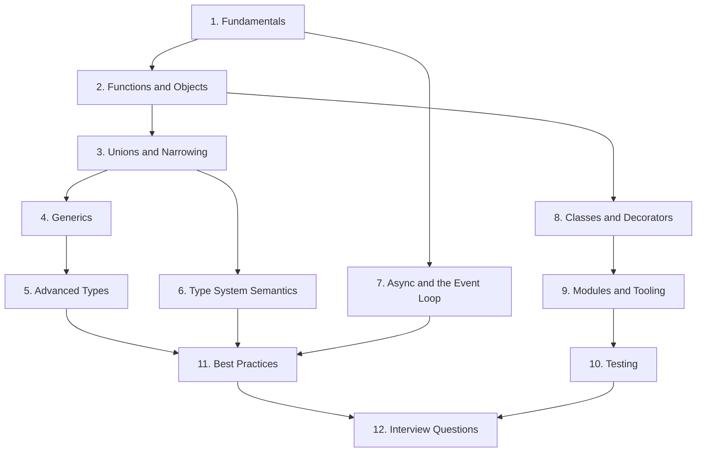

# TypeScript Interview Preparation Guide

TypeScript is a statically typed superset of JavaScript developed by Microsoft. Every valid JavaScript program is also a valid TypeScript program, but TypeScript adds a rich, compile-time-only type system on top: types are checked when you compile and then completely erased, so the JavaScript that runs in the browser or in Node.js contains no trace of them. Interviewers use TypeScript questions to probe two things at once — whether you understand JavaScript deeply (the event loop, closures, prototypes) and whether you can wield a modern structural type system (generics, narrowing, mapped and conditional types) to make large codebases safe and maintainable.

This guide takes you from fundamentals to the advanced type-level programming questions asked at senior interviews, and finishes with a large curated question bank.

## Table of Contents

| # | Guide | What you will learn |
|---|-------|---------------------|
| 1 | [TypeScript Fundamentals](./01-TypeScript-Fundamentals.md) | What TS adds over JS, the compile/erase model, tsconfig strict mode, basic types, `any` vs `unknown` vs `never`, tuples and enums |
| 2 | [Functions and Objects](./02-Functions-and-Objects.md) | Function types, overloads, `this` typing, object types, index signatures, `readonly`, interfaces vs type aliases |
| 3 | [Unions, Intersections and Narrowing](./03-Union-Intersection-and-Narrowing.md) | Union/intersection types, literal types, discriminated unions, type guards, exhaustiveness checking |
| 4 | [Generics](./04-Generics.md) | Generic functions/interfaces/classes, constraints, defaults, inference, `keyof`, indexed access types |
| 5 | [Advanced Types](./05-Advanced-Types.md) | Conditional types, `infer`, mapped types, template literal types, hand-rolled utility types, distributivity |
| 6 | [Type System Semantics](./06-Type-System-Semantics.md) | Structural typing, excess property checks, widening/narrowing, variance, unsoundness holes, branded types |
| 7 | [Async JavaScript and the Event Loop](./07-Async-JavaScript-and-the-Event-Loop.md) | Event loop, tasks vs microtasks, promises and async/await, Promise combinators, async pitfalls |
| 8 | [Classes and Decorators](./08-Classes-and-Decorators.md) | Typed classes, access modifiers, abstract classes, `implements`, ES decorators (NestJS/Angular style) |
| 9 | [Modules and Tooling](./09-Modules-and-Tooling.md) | ESM vs CommonJS, `import type`, declaration files, publishing typed packages, ESLint, monorepos |
| 10 | [Testing in TypeScript](./10-Testing-in-TypeScript.md) | Jest/Vitest with TS, typing mocks, testing types themselves, best practices |
| 11 | [Best Practices and Ecosystem](./11-TypeScript-Best-Practices-and-Ecosystem.md) | Strict config, avoiding `any`, runtime validation with zod, error handling, Node and React usage |
| 12 | [Interview Questions](./12-TypeScript-Interview-Questions.md) | 30+ questions with detailed answers, grouped junior / mid / senior |

## Suggested Study Order

1. **Week 1 — Core language.** Read guides 1–3. These cover what almost every TypeScript interview touches: the erasure model, `any` vs `unknown`, interfaces vs types, and discriminated unions with narrowing.
2. **Week 2 — Type-level power.** Work through guides 4–6. Generics and utility-type implementations (`Pick`, `Omit`, `DeepPartial`) are the classic mid/senior whiteboard exercises, and structural typing plus variance are where "gotcha" questions live.
3. **Week 3 — Runtime and ecosystem.** Guides 7–11. Event-loop output-prediction questions are extremely common; tooling and testing questions show up for full-stack and platform roles.
4. **Finally**, drill guide 12 until you can answer every question out loud without looking.

## How to Practice

- Keep the [TypeScript Playground](https://www.typescriptlang.org/play) open while you read; paste every snippet and hover over identifiers to see inferred types.
- Attempt the exercises on [type-challenges](https://github.com/type-challenges/type-challenges) after finishing guide 5.
- For every "what does this print?" async question in guide 7, predict the output on paper before running the code.
